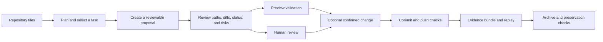
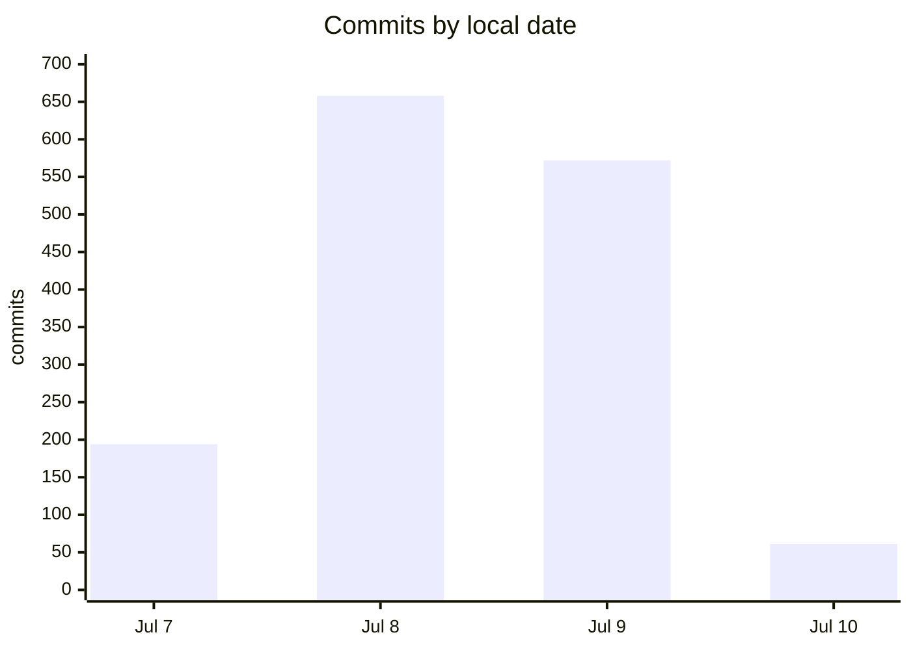
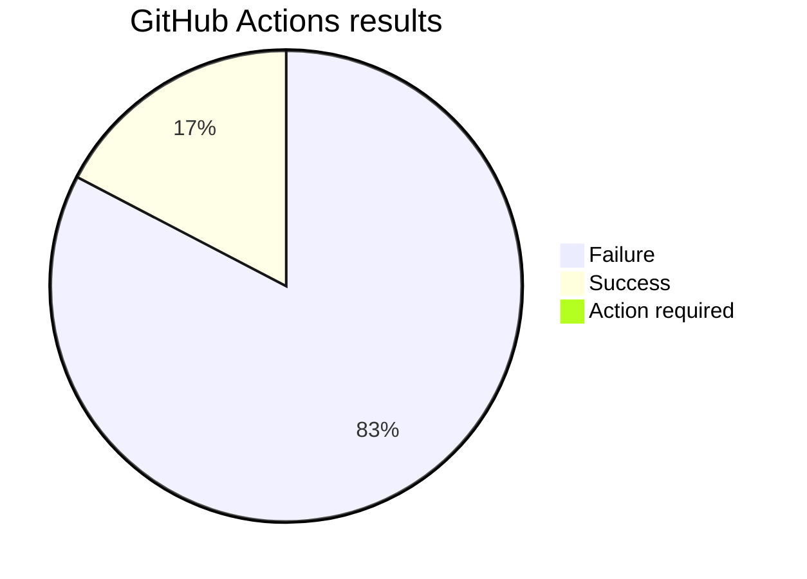

# Autonomous Forge

## The three-day Autonomus AI experiment

Autonomous Forge is an open-source Python tool built and maintained by scheduled AI agents. The agents were given a GitHub repository and permission to decide what to build, how to structure it, and how to improve it.

This README documents what happened during the experiment.

> Important: the private operating instructions used for the experiment are not included here.

## Short result

The experiment was successful as a research test, but the project is not production-ready.

The AI grew a small repository into a large safety and maintenance framework. The code installs, compiles, and many individual commands work. However, the final main branch has failing tests. The latest GitHub Actions run failed on Python 3.10, 3.11, and 3.12.

The best description is:

> A useful pre-alpha, human-in-the-loop safety framework — not a self-running AI engineer.

## What the project does

Autonomous Forge is a local-first command-line tool. It helps a maintainer or AI-assisted workflow move through a controlled maintenance process:



The repository does not call an AI model. The external scheduler and AI agents supplied the autonomy. Forge supplies local planning, safety checks, side-effect gates, and evidence records.

## What happened

The repository started with only a README and a license. By the final commit, it contained:

- Total lines added across all Git history: 49,200
- Total lines deleted across history: 11,616
- Actual lines currently present: 37,584 lines
- 283 tracked files.
- 112 Python source files.
- 90 Python test files.
- 68 documentation files.
- 6 `.ai` planning and memory files.
- 1,486 commits by the same Git author.
- 123 numbered `AUTO-###` task groups, reaching `AUTO-140`.
- No runtime dependencies.

### Commit activity

| Local date | Commits |
|---|---:|
| 7 July 2026 | 194 |
| 8 July 2026 | 658 |
| 9 July 2026 | 572 |
| 10 July 2026 | 61 |



One task was usually split into several commits: core code, CLI wiring, tests, smoke checks, documentation, roadmap, state, changelog, and decision records. This made the work easy to inspect, but it also created many CI runs.

## Main development stages

| Stage | Main work | Result |
|---|---|---|
| `AUTO-001`–`AUTO-014` | CLI, roadmap parsing, task selection, reports, policy, inventory | Small working local tool |
| `AUTO-015`–`AUTO-023` | Package CI, JSON output, planning, proposals, validation | Better review surface; first contract failures appeared |
| `AUTO-024`–`AUTO-062` | Review artifacts, run history, executor gates, content and diff audits | Large safety and evidence layer |
| `AUTO-063`–`AUTO-108` | Patch reviews, patch apply, git review, commit and push gates | Near end-to-end maintenance chain |
| `AUTO-109`–`AUTO-125` | Enriched context, replay, history links, reviewer handoffs | Stronger evidence, but more connected contracts |
| `AUTO-126`–`AUTO-140` | Archive manifests, copies, packages, verification, completeness | Detailed preservation workflow |

## Main features created

### Planning

- Reads a Markdown roadmap.
- Selects the highest-priority eligible task.
- Checks roadmap structure and task fields.
- Reads allowed paths, prohibited paths, and approval rules.
- Produces human-readable and JSON plans.

### Review and validation

- Builds change proposals and validation plans.
- Reviews planned files against policy.
- Reviews supplied diffs and file contents.
- Detects path escapes and symlinks.
- Creates validation previews without running commands.
- Stores and compares local run-history records.

### Controlled changes

Separate commands can, after explicit confirmation:

- apply a reviewed replacement patch;
- run one exact validation command with `shell=False`;
- create a local commit;
- perform a guarded, non-force push;
- write a local evidence copy or archive package.

The default review commands are read-only. The commands that can change files, run commands, create commits, or push changes are separate and confirmation-gated.

### Evidence and preservation

The final part of the experiment focused on proving that maintenance evidence had not changed:

- evidence bundles;
- hash-linked run-history records;
- replay summaries;
- reviewer handoffs;
- archive manifests;
- copied archive roots;
- `.tar`, `.tar.gz`, and `.zip` packages;
- package verification;
- final preservation-completeness checks;
- optional workflow-status freshness evidence.

## How the agents worked

The experiment used two roles:

1. a product-and-engineering role that selected and shipped improvements;
2. a maintenance role focused on failing tests, CI, and maintenance PRs.

Most product work was committed directly to `main`. The maintenance work created or updated branches and pull requests. The repository history contains eight pull requests: two merged, five closed without merging, and one open community pull request.

The `.ai` directory acted as project memory:

- `.ai/AUTONOMOUS_PLAN.md`
- `.ai/AUTONOMOUS_STATE.md`
- `.ai/AUTONOMOUS_CHANGELOG.md`
- `.ai/DECISIONS.md`

This was useful, but it was not a complete event log. The repository does not record a model ID, scheduler ID, token use, or a reliable agent ID for every commit. Therefore, the exact work split between the two AI agents cannot be proved from Git history alone.

## Testing and CI

### What worked

- 614 named test functions were found across 90 test files.
- The suite collected 652 tests in the audit environment.
- Tests use temporary directories and deterministic fixtures.
- CI tests Python 3.10, 3.11, and 3.12.
- CI installs the package, compiles the source, checks installed CLI commands, lints the roadmap, and runs pytest.
- Many safety cases are covered: path escapes, symlinks, malformed evidence, hash drift, missing files, overwrites, and missing confirmations.

### What failed

The final local audit produced:

```text
569 passed, 82 failed, 1 skipped
```

The latest [GitHub Actions run](https://github.com/OmarH-creator/Autonomous-Forge/actions/runs/29054022486) passed installation, compilation, CLI smoke checks, and roadmap linting. All three Python jobs failed at the test step.

The 82 local failures had three main causes:

- 59 maintenance, archive, and replay tests: newer context-consistency rules made older fixtures blocked.
- 21 planning, validation, executor, and review tests: newer output fields were added, but older assertions still expected the previous output.
- 2 router help tests: calling the Python `main()` function with `--help` raises `SystemExit(0)`, although process-level help exits successfully.

The first recorded CI failure was during `AUTO-019`, after a small output wording change. CI later became green at `AUTO-109`. After `AUTO-110` added richer plan fields to proposals and validation, the suite failed again and did not return to green in the visible history.

Across the available Actions history:

| Result | Runs |
|---|---:|
| Success | 242 |
| Failure | 1,153 |
| Action required | 1 |
| Total | 1,396 |



This is the most important weakness of the experiment: the agents kept adding features while the branch was failing.

There is no lint, type-check, coverage, or release workflow. There are no tags or GitHub releases. The only workflow in the repository is `.github/workflows/test.yml`; it is a test workflow, not an AI scheduler.

## Is it safe?

The design is safety-aware, but the safety is not proven end to end.

Positive controls include:

- local path and symlink containment;
- simple secret-marker checks without printing file contents;
- explicit confirmation flags for writes, commits, packages, and pushes;
- `shell=False` for the narrow executor command;
- no force push and no tag push;
- no telemetry or AI API code;
- read-only review commands separated from side-effect commands.

Important limits include:

- workflow freshness trusts supplied JSON evidence;
- evidence can be supplied by a caller, so provenance is not fully trusted;
- package signature and signer identity are not fully proved;
- secret detection is not a complete secret scanner;
- some commands can cause real local or remote side effects after confirmation;
- `main` is currently not branch protected;
- there is no shared lock for the external scheduled agents;
- the high-level overview documentation still describes the older read-only boundary.

## Why did the AI choose this project?

This is an inference from the files and commits, not a claim about hidden model reasoning.

The starting roadmap described a small local tool that could choose one task, check policy, and produce a dry-run report. The experiment also rewarded safe, reviewable changes and discouraged uncontrolled network access, secrets, unsafe commands, and unsafe merges.

A repository-maintenance tool was therefore a natural choice because:

- it matched the safety limits;
- it gave the AI a clear list of small tasks;
- it could be built with standard-library Python;
- each feature could have tests, JSON output, and documentation;
- the repository could act as its own memory.

The project is self-referential: an AI-maintained repository created a tool for safer AI-assisted repository maintenance. This made the experiment easy to continue, but it also encouraged the AI to build more tools for building tools instead of solving one concrete user problem.


## Final judgement

### What succeeded

The AI showed that it can grow a repository from a two-file start into a structured project with a clear architecture, many tests, safety boundaries, and durable engineering memory.

### What did not succeed

It did not keep the main branch green. It also did not create an AI runtime, an in-repository scheduler, a clean end-to-end demo, or a production release.

### What it is useful for today

Use it as:

- a case study of AI software stewardship;
- a reference for human-in-the-loop maintenance gates;
- a starting point for safer repository automation;
- a testbed for evidence and replay design.

Do not yet use it as an unattended tool for important repositories.

## Lessons for future experiments

1. Stop feature work whenever `main` is red.
2. Add one shared lock or lease for all scheduled agents.
3. Add a circuit breaker after repeated CI failures.
4. Record agent role, run ID, start/end time, commit list, and CI result. Do not record private prompts.
5. Use one coherent commit per stewardship cycle, or cancel obsolete CI runs.
6. Treat JSON output schemas as contracts and update fixtures before changing them.
7. Add one end-to-end test in a temporary repository: plan → review → patch → validate → commit → evidence.
8. Fix the current failures before adding more preservation features.
9. Choose a concrete user problem and measure whether the project solves it.

The central lesson is simple:

> Autonomous coding can create impressive structure very quickly. Validation discipline must decide what is allowed to remain.
