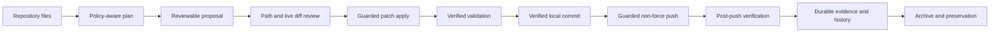

# Autonomous Forge

Autonomous Forge is an open-source, local-first Python CLI built through an AI software-stewardship experiment. It is a **pre-alpha, human-in-the-loop maintenance safety framework**, not an unattended AI engineer.

The repository does not call an AI model itself. External agents supply autonomy; Forge supplies repository planning, policy checks, guarded side-effect gates, Git verification, and durable maintenance evidence.

## What it does

```mermaid
flowchart LR
    A[Repository files] --> B[Policy-aware plan]
    B --> C[Reviewable proposal]
    C --> D[Path and live diff review]
    D --> E[Guarded patch apply]
    E --> F[Verified validation]
    F --> G[Verified local commit]
    G --> H[Guarded non-force push]
    H --> I[Post-push verification]
    I --> J[Durable evidence and history]
    J --> K[Archive and preservation]
```

Forge keeps review stages separate from stages that can change files, run commands, commit, push, or persist evidence. Side effects require explicit confirmation at the relevant boundary.

## Main capabilities

### Policy-aware planning

`forge plan` reads the repository roadmap, policy, state, and documented project files; selects the highest-priority eligible task; identifies allowed/prohibited areas; and emits a concrete reviewable plan with expected files, validation steps, risks, and reasons. It is local-first and read-only.

### Review and guarded change

Forge can build change proposals and validation plans, review planned paths against policy, inspect supplied or live tracked Git diffs, reject path escapes and malformed evidence, apply a confirmed replacement, verify the resulting target-scoped live diff, roll back on verification failure, and execute exact retained validation commands with bounded `shell=False` subprocesses.

### Verified maintenance chain

The connected workflow now includes:

- `forge verified-change-apply-run`: guarded replacement write → live-diff verification → retained validations → optional verified local commit, with separate apply/validation/commit confirmations.
- `forge verified-push-run`: verified commit → trust/status/protection readiness → separately confirmed fast-forward push → post-push verification.
- `forge verified-maintenance-run`: post-push-verified evidence → canonical durable bundle → `.ai/run-history/` link, with separate persistence confirmations.
- `forge verified-full-maintenance-run`: composes the full guarded apply → validation → commit → push → post-push → durable-history lifecycle in one invocation while preserving independent authority gates for every side effect.

The underlying planning, diff review, patch, validation, commit, push, replay, archive, package, and preservation commands remain independently usable and reviewable.

## Evidence and preservation

Forge supports SHA-linked maintenance bundles, run-history records, replay/reviewer handoffs, archive manifests, copied archive roots, `.tar`/`.tar.gz`/`.zip` packaging, package verification, and preservation-completeness checks.

## Testing and CI

The repository workflow targets Python **3.10, 3.11, and 3.12**. It installs the package, compiles source, smoke-tests the installed CLI, validates the roadmap, and runs pytest.

AUTO-141/AUTO-142 were dedicated baseline-recovery milestones. Subsequent work connected live diff review, guarded patching, validation, commit verification, non-force push, post-push verification, and durable evidence into one maintenance workflow.

There is still no dedicated lint, type-check, coverage, or release workflow, and there are no tagged releases.

## Safety boundary

Positive controls include repository path/symlink containment, policy-aware path checks, simple secret-marker checks, explicit confirmations for every side effect, bounded `shell=False` command execution, rollback after failed post-write diff verification, SHA-256 evidence binding, complete retained-validation coverage before commit readiness, exact changed-path commit verification, fast-forward-only non-force push behavior, no tag pushes or remote/protection mutation, post-push reachability verification, and durable evidence hashing.

Important limitations remain:

- live diff review covers tracked changes, not untracked files;
- passing configured validation commands does not prove those commands are sufficient for correctness;
- commit-trust, commit-status, and branch-protection inputs are still caller-supplied evidence rather than independently acquired fresh GitHub proof;
- post-push verification relies on local remote-tracking refs unless fetch is explicitly requested;
- hashes detect byte drift but do not prove signer identity;
- secret detection is not a full secret scanner;
- there is no shared lock for external scheduled agents;
- Forge is not ready for unattended use on important repositories.

## Project memory

The `.ai` directory is the repository's engineering memory:

- `.ai/AUTONOMOUS_PLAN.md`
- `.ai/AUTONOMOUS_STATE.md`
- `.ai/AUTONOMOUS_CHANGELOG.md`
- `.ai/DECISIONS.md`

Historical branches and pull requests are inspect-before-integrate evidence only. Current stewardship works directly on `main` and does not create replacement PRs.

## Current Autonomous Status

Latest stewardship run: **AUTO-160 — prove the full maintenance orchestrator in a disposable repository**.

- **Changed:** migrated `tests/test_end_to_end_maintenance_workflow.py` from manual stage-by-stage composition to `verified-full-maintenance-run`. The test now drives guarded patch application, mandatory live-diff verification, real validation execution, verified commit creation, real fast-forward push to a local bare remote, fetch, post-push remote verification, persisted verified-push evidence, durable bundle persistence, and run-history linking through the current single orchestration surface.
- **Safety:** apply, validation, commit, push, push-evidence write, bundle write, and history-link write remain independently confirmed. Only the external commit-trust/status/branch-protection acquisition boundary is injected deterministically after the newly created commit SHA exists; the real verified push runner and all local Git/durable-evidence operations remain exercised. No force-push, tag push, remote mutation, branch-protection mutation, workflow mutation, or new network capability was added.
- **Validation:** the available connected status/workflow lookup still exposes no push-triggered check objects for the previous AUTO-159 head, so this run does not fabricate a green baseline claim. AUTO-160 adds deterministic integration coverage intended for the existing Python 3.10/3.11/3.12 matrix; the final pushed-head Actions result remains the source of truth when observable.
- **Visual updates:** none; the existing Mermaid lifecycle already depicts the exact flow now exercised by the integration test.
- **Current limitations:** fresh commit-trust, workflow-status, and branch-protection acquisition remains the largest product gap. Those inputs are still supplied evidence, and the integration test explicitly labels them as deterministic stand-ins rather than fresh GitHub proof.
- **Next autonomous objective:** if AUTO-160 CI is green, add a bounded, policy-approved acquisition path for fresh trust/status/protection evidence so the full orchestrator can reduce caller-prepared external evidence without weakening its existing SHA/path/status safeguards.