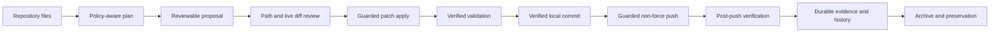

# Autonomous Forge

Autonomous Forge is an open-source, local-first Python CLI built through an AI software-stewardship experiment. It is best understood as a **pre-alpha, human-in-the-loop maintenance safety framework**, not an unattended AI engineer.

The repository does not call an AI model itself. External agents supplied the autonomy; Forge supplies repository planning, policy checks, guarded side-effect gates, Git verification, and durable maintenance evidence.

## What it does


```mermaid
flowchart LR
    A[Repository files] --> B[Policy-aware plan]
    B --> C[Reviewable proposal]
    C --> D[Path and live diff review]
    D --> E[Guarded patch apply]
    E --> F[Verified validation]
    F --> G[Verified local commit]
    G --> H[Guarded non-force push]
    H --> I[Post-push verification]
    I --> J[Durable evidence and history]
    J --> K[Archive and preservation]
```

Forge keeps the review stages separate from the stages that can change files, run commands, commit, push, or persist evidence. Side effects require explicit confirmation at the relevant boundary.

## Main capabilities

### Policy-aware planning

`forge plan` is the policy-aware planning milestone that started the product direction. It:

- reads the repository roadmap, policy, state, and documented project files;
- chooses the highest-priority eligible task;
- identifies allowed and prohibited file areas;
- produces a concrete reviewable implementation plan;
- lists expected files, validation steps, risks, and reasons;
- remains local-first and read-only.

### Review and guarded change

Forge can:

- build change proposals and validation plans;
- review planned paths against policy;
- inspect a supplied patch or the repository's current tracked diff relative to `HEAD`;
- reject path escapes, unsafe symlinks, malformed evidence, and context drift;
- apply a confirmed reviewed replacement and verify its actual target-scoped Git diff;
- restore the original target if post-write diff verification fails;
- execute exact retained validation commands with `shell=False` and bounded timeouts.

### Verified commit and push chain

The maintenance chain now includes:

- `forge verified-change-run`: executes every retained validation step, builds verified commit readiness, and can create and immediately verify the reviewed local commit. Validation and commit creation keep separate confirmations.
- `forge verified-change-apply-run`: composes the guarded replacement write, mandatory live-diff verification, all retained validation steps, and optional verified local commit without requiring a caller-managed intermediate patch-apply JSON file. Patch apply, validation, and commit creation remain three independent confirmations.
- `forge verified-push-run`: consumes either a completed committed `verified-change-run` artifact or the newer committed `verified-change-apply-run` wrapper, carries the verified commit through commit-trust, status, and branch-protection readiness, and can execute the existing guarded non-force push only with a **separate `--confirm-push` authority gate**. Wrapper mode verifies the retained patch/application/validation/commit evidence before using the nested commit and preserves that wrapper in the push result. After a completed push it performs post-push remote verification; optional fetching is separately requested with `--fetch-after-push`.
- `forge verified-maintenance-run`: consumes a completed `post_push_verified` push-run artifact and, when it retains `change_apply_run`, derives the canonical patch, validation, and commit stages directly from that embedded provenance. The durable bundle and `.ai/run-history/` link remain under two **separate** write confirmations. Older push-run artifacts can still use the historical three explicit stage files together.
- `forge verified-full-maintenance-run`: composes guarded apply → validation → verified commit → guarded push → post-push verification → durable bundle/history in one invocation while preserving **independent confirmations for every side effect**. It persists the verified push artifact under its own confirmation before bundle construction so later source-report hash verification remains possible.
- the underlying `verified-push-handoff`, `post-push-verify`, maintenance evidence, replay, archive, package, and preservation commands remain independently usable and reviewable.

A typical push-stage invocation using the embedded apply-to-commit artifact is:

```bash
forge verified-push-run \
  --change-apply-run .ai/evidence/verified-change-apply-run.json \
  --commit-trust .ai/evidence/commit-trust.json \
  --status-review .ai/evidence/commit-status.json \
  --branch-protection .ai/evidence/branch-protection.json \
  --branch main \
  --remote origin \
  --confirm-push \
  --fetch-after-push \
  --require-post-push-verified \
  --format json
```

For backward compatibility, `--change-run` remains available and is mutually exclusive with `--change-apply-run`. Without `--confirm-push`, the command can report `ready_for_push` but cannot treat validation or commit confirmation as push authority.

A completed push run that retains the change-apply wrapper can then be preserved without splitting any earlier stages back into duplicate JSON files:

```bash
forge verified-maintenance-run \
  --verified-push-run .ai/evidence/verified-push-run.json \
  --bundle-id AUTO-158 \
  --output .ai/evidence/AUTO-158-bundle.json \
  --confirm-bundle-write \
  --history-link .ai/run-history/AUTO-158.json \
  --confirm-history-link \
  --require-complete \
  --require-history-linked \
  --format json
```

### Evidence and preservation

Forge also supports:

- evidence bundles with verified push/post-push provenance binding;
- hash-linked run-history records;
- replay summaries and reviewer handoffs;
- archive manifests and copied archive roots;
- `.tar`, `.tar.gz`, and `.zip` packaging;
- package verification and preservation-completeness checks;
- optional workflow-status freshness evidence.

## Development history

The project began as a tiny roadmap-driven CLI and grew into a connected maintenance framework. Major stages include:

| Stage | Result |
|---|---|
| `AUTO-001`–`AUTO-014` | Core CLI, roadmap parsing, task selection, policy and inventory |
| `AUTO-015`–`AUTO-062` | Planning, proposals, validation, audit and run-history contracts |
| `AUTO-063`–`AUTO-108` | Patch application, Git review, commit and push gates |
| `AUTO-109`–`AUTO-140` | Enriched replay, reviewer handoffs, archive and preservation workflow |
| `AUTO-141`–`AUTO-142` | Dedicated red-baseline recovery; supported Python matrix restored to green |
| `AUTO-143`–`AUTO-152` | Live Git diff inspection through verified patch, validation, commit, push, post-push, durable evidence, and an end-to-end disposable-repository proof |
| `AUTO-153` | First orchestration surface: verified validation through local commit creation |
| `AUTO-154` | Second orchestration surface: committed verified change through separately confirmed push and post-push verification |
| `AUTO-155` | Third orchestration surface: post-push-verified run through separately confirmed canonical durable bundle and run-history persistence |
| `AUTO-156` | Guarded patch application through verified validation/commit using embedded SHA-bound patch evidence instead of an intermediate patch JSON handoff |
| `AUTO-157` | Verified push orchestration accepts and preserves the committed change-apply wrapper without splitting nested change evidence back into another JSON handoff |
| `AUTO-158` | Durable maintenance orchestration derives patch, validation, and commit stages directly from the retained change-apply wrapper, eliminating the remaining canonical stage-file split |
| `AUTO-159` | Full lifecycle orchestration connects guarded change, verified push, and durable history while retaining separate apply, validation, commit, push, evidence-write, bundle-write, and history-link authority gates |

## Testing and CI

The main workflow tests Python **3.10, 3.11, and 3.12**. It installs the package, compiles source, smoke-tests the installed CLI, validates the roadmap, and runs pytest.

A historical audit reached `569 passed, 82 failed, 1 skipped`. AUTO-141/AUTO-142 paused feature work and repaired the actual compatibility, fixture, routing, context-consistency, and archive-path defects instead of suppressing failures. The supported matrix has remained green through the subsequent verified-maintenance integration work.

AUTO-157 final head `bb96744cf3cb2ad904e5011199af1938e700bb52` is the pre-AUTO-158 baseline. AUTO-158 validation is recorded in the Current Autonomous Status below and the final GitHub Actions result is the source of truth.

There is still no dedicated lint, type-check, coverage, or release workflow, and there are no tagged releases.

## Safety boundary

Positive controls include:

- repository path and symlink containment;
- policy-aware allowed/prohibited path checks;
- simple secret-marker checks without printing file contents;
- explicit confirmations for writes, validation execution, commits, pushes, package writes, and durable evidence writes;
- `shell=False` for the narrow command executor and live Git-diff inspection;
- target-scoped post-write diff verification with rollback on verification failure;
- canonical SHA-256 binding between embedded guarded-patch evidence and its validation observations;
- complete retained-validation coverage before verified commit readiness;
- exact changed-path verification after commit creation;
- fast-forward-only, non-force guarded push behavior;
- no tag pushes, remote mutations, or branch-protection changes from the verified push path;
- post-push remote reachability verification;
- durable evidence hashing and replay/preservation checks.

Important limitations remain:

- live current-diff review covers tracked changes, not untracked files;
- validation coverage proves the configured commands passed, not that those commands are sufficient for correctness;
- commit-trust, commit-status, and branch-protection JSON are still supplied evidence rather than independently acquired fresh GitHub proof;
- post-push verification relies on local remote-tracking refs unless fetch is explicitly requested;
- hashes detect byte drift but do not prove signer identity;
- secret detection is not a full secret scanner;
- there is no shared lock for external scheduled agents;
- Forge is not ready for unattended use on important repositories.

## Project memory

The `.ai` directory is the repository's engineering memory:

- `.ai/AUTONOMOUS_PLAN.md`
- `.ai/AUTONOMOUS_STATE.md`
- `.ai/AUTONOMOUS_CHANGELOG.md`
- `.ai/DECISIONS.md`

Historical branches and pull requests are inspect-before-integrate evidence only. Current stewardship works directly on `main` and does not create replacement PRs.

## Current Autonomous Status

Latest stewardship run: **AUTO-159 — compose the verified maintenance lifecycle without collapsing authority gates**.

- **Changed:** added `forge verified-full-maintenance-run`, which can carry one reviewed replacement through guarded apply, mandatory live-diff verification, all retained validations, verified local commit creation, guarded fast-forward push, post-push verification, persisted verified-push evidence, canonical durable bundle writing, and `.ai/run-history/` linking in one invocation.
- **Safety:** apply, validation, commit, push, verified-push evidence persistence, bundle persistence, and history-link persistence remain seven independent confirmations. The push-evidence output refuses overwrite, and the persisted artifact is intentionally required before bundle construction so later maintenance-bundle verification can recompute byte counts and SHA-256 hashes. No force-push, tag push, remote mutation, branch-protection change, workflow rerun, or workflow polling was added.
- **Validation:** focused deterministic tests cover stopping before push when commit authority is absent, stopping after post-push verification when push-evidence persistence is unconfirmed, successful progression only when every persistence gate is confirmed, overwrite refusal, and primary-router help exposure. A checkout-capable environment is unavailable because direct GitHub DNS resolution fails here; the final GitHub Actions result is therefore the source of truth for Python 3.10/3.11/3.12 validation.
- **Visual updates:** none; the existing Mermaid flow already depicts the same patch → validation → commit → push → post-push → durable-evidence lifecycle, and another diagram would duplicate it.
- **Current limitations:** commit-trust, workflow-status, and branch-protection are still supplied repository-local evidence rather than freshly acquired GitHub proof. The full orchestrator deliberately requires a persisted verified-push artifact before durable evidence so existing source-report verification stays truthful.
- **Next autonomous objective:** once final AUTO-159 CI is confirmed green, update the disposable-repository end-to-end test to exercise this single orchestration surface directly; after that, fresh bounded acquisition of trust/status/protection evidence is the highest-value remaining product gap, subject to repository policy approval for external-service access.
