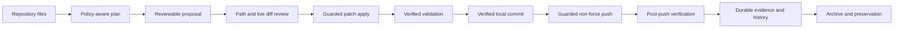

# Autonomous Forge

Autonomous Forge is an open-source, local-first Python CLI built through an AI software-stewardship experiment. It is a **pre-alpha, human-in-the-loop maintenance safety framework**, not an unattended AI engineer.

The repository does not call an AI model itself. External agents supply autonomy; Forge supplies repository planning, policy checks, guarded side-effect gates, Git verification, and durable maintenance evidence.

## What it does

```mermaid
flowchart LR
    A[Repository files] --> B[Policy-aware plan]
    B --> C[Reviewable proposal]
    C --> D[Path and live diff review]
    D --> E[Guarded patch apply]
    E --> F[Verified validation]
    F --> G[Verified local commit]
    G --> H[Guarded non-force push]
    H --> I[Post-push verification]
    I --> J[Durable evidence and history]
    J --> K[Archive and preservation]
```

Forge keeps review stages separate from stages that can change files, run commands, commit, push, or persist evidence. Side effects require explicit confirmation at the relevant boundary.

## Main capabilities

### Policy-aware planning

`forge plan` reads the repository roadmap, policy, state, and documented project files; selects the highest-priority eligible task; identifies allowed/prohibited areas; and emits a concrete reviewable plan with expected files, validation steps, risks, and reasons. It is local-first and read-only.

### Review and guarded change

Forge can build change proposals and validation plans, review planned paths against policy, inspect supplied or live tracked Git diffs, reject path escapes and malformed evidence, apply confirmed replacements with stale-target protection, verify resulting diffs, and execute retained validation commands with bounded `shell=False` subprocesses.

Guarded patch application now also treats a failed parent-directory durability sync as a failed write transaction when recovery is still safe: Forge retains the exact original target bytes and mode, SHA-256 binds the replacement, and restores the original only while the target still matches this invocation's replacement. If a competing writer changes the target before rollback, Forge preserves those changed bytes rather than overwriting them.

### Verified maintenance chain

The connected workflow includes guarded replacement → live-diff verification → retained validation → optional verified local commit → trust/status/protection readiness → separately confirmed fast-forward push → post-push verification → durable maintenance evidence and history. The higher-level `forge verified-full-maintenance-run` composes that lifecycle while keeping independent authority gates for side effects.

Verified commit creation isolates staging through a private temporary Git index, binds reviewed target bytes and changed paths to the expected parent, refuses unrelated shared staging, and rechecks reviewed state before and after commit synchronization. Shared-index synchronization now acquires Git's conventional `index.lock`, rechecks reviewed entries while that lock is held, updates a lock-backed snapshot, and atomically publishes it. A caller-owned lock or a competing reviewed-path staging change causes synchronization to fail closed rather than overwrite caller staging.

Confirmed push handoff now also revalidates the local branch, `HEAD`, configured upstream, and remote-tracking branch immediately before executing the non-force push. Branch/HEAD/upstream drift blocks execution, and a moved remote-tracking ref triggers a fresh fast-forward ancestry check before the push can proceed.

Verified push-run evidence ingestion is bounded at the actual file read: Forge reads at most 1,000,001 bytes, rejects anything beyond the 1,000,000-byte review limit before UTF-8/JSON parsing, and no longer relies on a pre-read `stat()` that a concurrently growing file could race.

Executor handoff persistence keeps observed executor output reviewable before it becomes durable validation history. The reviewed executor-run JSON must stay inside the repository, be a real `.json` file, and is read through a strict 1,000,000-byte bound before UTF-8 and JSON parsing so the persistence bridge cannot consume an unbounded input file.

## Evidence and preservation

Forge supports SHA-linked maintenance bundles, run-history records, replay/reviewer handoffs, archive manifests, copied archive roots, `.tar`/`.tar.gz`/`.zip` packages, package verification, preservation-completeness checks, and immutable preservation receipts.

Durable writers use repository confinement, explicit confirmation, no-clobber publication, file/directory `fsync`, SHA-256 binding, and fail-closed verification. Archive hashing and package member verification stream in bounded chunks instead of materializing complete evidence files in memory.

Recent preservation hardening includes:

- archive manifests bind selected evidence, including run-history-link bytes where authoritative digests exist;
- archive copy/package verification hashes content incrementally and rejects byte-count or digest drift;
- archive manifests and archive packages are immediately reverified after publication;
- failed or Python-interrupted verification rolls back only bytes still owned by the current invocation;
- archive-manifest publication now also performs ownership-checked rollback when parent-directory durability sync fails after the no-clobber hard link succeeds;
- archive-package and archive-copy publication perform ownership-checked rollback when parent-directory durability sync fails after publication;
- immutable validation-result sidecar publication applies the same ownership-checked rollback rule when its parent-directory durability sync fails;
- the historical in-place validation-result writer restores the exact original run-history bytes when its post-replacement directory sync fails, but only while the current record still matches this invocation's replacement digest;
- immutable run-history publication removes its own unchanged record when the post-link parent-directory durability sync fails, while preserving a destination whose bytes changed before rollback;
- verified full-maintenance push-evidence publication removes its own unchanged JSON when the post-link parent-directory durability sync fails, while preserving a destination whose bytes changed before rollback;
- maintenance evidence bundle and history-link publication now use the same ownership-checked rollback rule after post-link parent-directory durability failure;
- immutable preservation-receipt publication now also removes only its own unchanged receipt when post-link parent-directory durability sync fails, and preserves a concurrently changed destination;
- preservation-receipt verification and discovery use bounded input/candidate limits and remain informational rather than readiness gates;
- externally supplied validation sidecars remain advisory provenance and are never promoted into executor-produced validation authority.

See `docs/EXECUTOR_HANDOFF_PERSISTENCE.md`, `docs/RUN_HISTORY_WRITES.md`, `docs/ARCHIVE_MANIFEST_DURABILITY_ROLLBACK.md`, `docs/PUSH_EVIDENCE_DURABILITY_ROLLBACK.md`, `docs/MAINTENANCE_EVIDENCE_DURABILITY_ROLLBACK.md`, `docs/PRESERVATION_RECEIPT_DURABILITY_ROLLBACK.md`, `docs/PATCH_APPLY.md`, `docs/VERIFIED_COMMIT_SHARED_INDEX_LOCKING.md`, `docs/PUSH_HANDOFF_PRE_EXECUTION_REVALIDATION.md`, and `docs/VERIFIED_PUSH_BOUNDED_JSON_INPUT.md` for the current write- and execution-integrity boundaries.

## Testing and CI

The repository workflow targets Python **3.10, 3.11, and 3.12**. It installs the package, compiles source, smoke-tests the installed CLI, validates the roadmap, and runs pytest.

There is still no dedicated lint, type-check, coverage, or release workflow, and there are no tagged releases.

## Safety boundary

Important controls include repository path/symlink containment, policy-aware path checks, explicit confirmations for side effects, bounded local subprocesses, bounded verified-push and executor-handoff input, stale-target refusal, SHA-256 evidence binding, private-index commit isolation, shared-index lock-aware synchronization, immediate pre-push local-state revalidation, fast-forward-only non-force push behavior, post-push verification, no-clobber durable publication, bounded-memory archive hashing, and ownership-checked rollback of newly published or replaced evidence and guarded patch targets.

Important limitations remain:

- live diff review covers tracked changes, not untracked files;
- passing configured validation commands does not prove those commands are sufficient for correctness;
- hashes prove byte continuity, not signer identity;
- secret detection is not a full secret scanner;
- Git's `index.lock` protects against normal Git writers, not arbitrary processes that directly mutate `.git/index` while ignoring Git locking;
- remote-tracking refs are local evidence and can be stale relative to the server; the ordinary non-force push remains the authoritative receive-side fast-forward check;
- no filesystem-level lock can permanently prevent later evidence mutation;
- Python cleanup cannot run after abrupt termination such as `SIGKILL`, host failure, interpreter crash, or power loss;
- a filesystem that fails both publication and rollback directory sync leaves durability uncertain and requires inspection;
- ownership-checked rollback still has a small cross-process race between its final digest check and deletion/replacement because Forge does not hold a shared filesystem lock;
- archive-copy publication is per-file rather than a cross-file transaction;
- no-clobber durable publication relies on ordinary same-filesystem hard-link support;
- Forge is not ready for unattended use on important repositories.

## Project memory

The `.ai` directory is the repository's engineering memory:

- `.ai/AUTONOMOUS_PLAN.md`
- `.ai/AUTONOMOUS_STATE.md`
- `.ai/AUTONOMOUS_CHANGELOG.md`
- `.ai/DECISIONS.md`

Historical branches and pull requests are inspect-before-integrate evidence only. Current stewardship works directly on `main` and does not create replacement PRs.

## Current Autonomous Status

Latest stewardship run: **AUTO-251 — bounded verified-push evidence reads**.

- **Changed:** the repository-local JSON reader used by `forge verified-push-run` now reads at most 1,000,001 bytes and rejects any input beyond the 1,000,000-byte review limit before UTF-8 decoding or JSON parsing.
- **Why:** the prior implementation checked `stat().st_size` and then called unbounded `read_text()`. A file that grew after the size check could therefore bypass the intended review bound and consume arbitrary memory in the real push/post-push orchestration path.
- **Validation:** deterministic tests cover a valid bounded JSON object, an oversized input whose underlying reader is invoked exactly once with the sentinel limit, and invalid UTF-8. The final pushed head must pass the full Python 3.10/3.11/3.12 GitHub Actions workflow before this run is marked complete.
- **Safety:** repository confinement, no-symlink handling, `.json` enforcement, UTF-8/JSON object validation, and all existing push confirmation/trust/status/protection gates remain unchanged. No new network, command, push, remote, workflow, or branch-protection authority was added.
- **Branch/PR disposition:** all eight visible branches, open issues, and recent PR history were inspected. Seven non-main branches remain historical/diverged, there are no open PRs, and issues #1, #6, and #9 remain broader product/discussion requests rather than blockers for this repair.
- **Visual updates:** none; workflow topology did not change, only the bounded-input behavior at an existing execution boundary.
- **Current limitations:** bounded reading prevents memory growth beyond the configured evidence-review limit but does not make an evidence file immutable; the existing provenance and commit-identity checks remain responsible for authority and consistency.
- **Next autonomous objective:** continue through the post-push verification → durable-evidence handoff and inspect commit/remote identity binding for a concrete stale-state defect; any fresh CI failure takes priority.