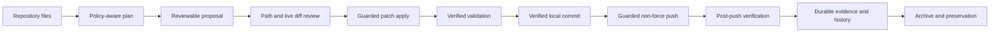

# Autonomous Forge

Autonomous Forge is an open-source, local-first Python CLI built through an AI software-stewardship experiment. It is best understood as a **pre-alpha, human-in-the-loop maintenance safety framework**, not an unattended AI engineer.

The repository does not call an AI model itself. External agents supplied the autonomy; Forge supplies repository planning, policy checks, guarded side-effect gates, Git verification, and durable maintenance evidence.

## What it does


```mermaid
flowchart LR
    A[Repository files] --> B[Policy-aware plan]
    B --> C[Reviewable proposal]
    C --> D[Path and live diff review]
    D --> E[Guarded patch apply]
    E --> F[Verified validation]
    F --> G[Verified local commit]
    G --> H[Guarded non-force push]
    H --> I[Post-push verification]
    I --> J[Durable evidence and history]
    J --> K[Archive and preservation]
```

Forge keeps review stages separate from stages that can change files, run commands, commit, push, or persist evidence. Side effects require explicit confirmation at the relevant boundary.

## Main capabilities

### Policy-aware planning

`forge plan` reads the roadmap, policy, state, and documented project files; chooses the highest-priority eligible task; identifies allowed and prohibited areas; and emits a concrete read-only implementation plan with expected files, validation steps, risks, and reasons.

### Review and guarded change

Forge can build change proposals and validation plans, inspect supplied patches or the repository's current tracked diff relative to `HEAD`, reject path escapes and context drift, apply a confirmed reviewed replacement, verify the actual target-scoped Git diff, roll back on failed post-write verification, and execute exact retained validation commands with `shell=False` and bounded timeouts.

### Verified commit and push chain

The integrated maintenance chain includes:

- `forge verified-change-run`: executes every retained validation step, builds verified commit readiness, and can create and immediately verify the reviewed local commit. Validation and commit creation keep separate confirmations.
- `forge verified-change-apply-run`: composes confirmed guarded patch application, mandatory live-diff verification, validation, and optional verified local commit creation without requiring an intermediate patch-apply JSON file.
- `forge verified-push-run`: accepts either a committed standalone `verified-change-run` artifact **or** the newer committed `verified-change-apply-run` wrapper. Wrapper mode verifies the patch/validation/commit confirmation chain and nested evidence consistency, then retains that wrapper in the push result so provenance is not lost. Push remains protected by its own `--confirm-push` gate.
- `forge verified-maintenance-run`: carries a successful post-push-verified run into the canonical durable maintenance bundle and `.ai/run-history/` path under separate bundle-write and history-link confirmations.
- the underlying `verified-push-handoff`, `post-push-verify`, maintenance evidence, replay, archive, package, and preservation commands remain independently usable.

A push-stage invocation using the embedded apply-to-commit artifact is:

```bash
forge verified-push-run \
  --change-apply-run .ai/evidence/verified-change-apply-run.json \
  --commit-trust .ai/evidence/commit-trust.json \
  --status-review .ai/evidence/commit-status.json \
  --branch-protection .ai/evidence/branch-protection.json \
  --branch main \
  --remote origin \
  --confirm-push \
  --fetch-after-push \
  --require-post-push-verified \
  --format json
```

For backward compatibility, `--change-run` remains available and is mutually exclusive with `--change-apply-run`. Without `--confirm-push`, the command may report `ready_for_push` but does not treat earlier patch, validation, or commit confirmations as push authority.

### Evidence and preservation

Forge supports provenance-bound maintenance bundles, hash-linked run-history records, replay summaries, reviewer handoffs, archive manifests and copied archive roots, `.tar`, `.tar.gz`, and `.zip` packaging, package verification, preservation-completeness checks, and optional workflow-status freshness evidence.

## Development history

The project began as a small roadmap-driven CLI and grew into a connected maintenance framework. Major stages include:

| Stage | Result |
|---|---|
| `AUTO-001`–`AUTO-014` | Core CLI, roadmap parsing, task selection, policy and inventory |
| `AUTO-015`–`AUTO-062` | Planning, proposals, validation, audit and run-history contracts |
| `AUTO-063`–`AUTO-108` | Patch application, Git review, commit and push gates |
| `AUTO-109`–`AUTO-140` | Replay, reviewer handoffs, archive and preservation workflow |
| `AUTO-141`–`AUTO-142` | Red-baseline recovery; supported Python matrix restored to green |
| `AUTO-143`–`AUTO-152` | Live diff through verified patch, validation, commit, push, post-push, durable evidence, and disposable-repository end-to-end proof |
| `AUTO-153`–`AUTO-155` | Orchestration surfaces from validation/commit through push/post-push and durable history |
| `AUTO-156` | Guarded patch application through validation/commit with embedded SHA-bound patch evidence |
| `AUTO-157` | `verified-push-run` consumes the committed change-apply wrapper directly and preserves it through the push stage |

## Testing and CI

The main workflow tests Python **3.10, 3.11, and 3.12**. It installs the package, compiles source, smoke-tests the installed CLI, validates the roadmap, and runs pytest.

AUTO-141/AUTO-142 restored a previously red baseline without suppressing failures. The supported matrix has remained green through the verified-maintenance integration work. AUTO-156 final head `b1eb018cb4b15acc98771f2d304362a62c739ac8` passed Actions run `32041811743` across all supported Python versions.

There is still no dedicated lint, type-check, coverage, or release workflow, and there are no tagged releases.

## Safety boundary

Positive controls include repository path and symlink containment; policy-aware allowed/prohibited path checks; explicit confirmations for writes, validation execution, commits, pushes, package writes, and durable evidence writes; `shell=False` for narrow execution and live Git-diff inspection; target-scoped post-write diff verification with rollback; SHA-256 binding of embedded patch evidence; complete retained-validation coverage before commit readiness; exact changed-path verification after commit creation; fast-forward-only non-force push behavior; post-push remote reachability verification; and durable evidence hashing/replay checks.

Important limitations remain:

- live current-diff review covers tracked changes, not untracked files;
- validation proves configured commands passed, not that those commands are sufficient for correctness;
- commit-trust, commit-status, and branch-protection JSON are supplied evidence rather than independently acquired fresh GitHub proof;
- post-push verification relies on local remote-tracking refs unless fetch is explicitly requested;
- hashes detect byte drift but do not prove signer identity;
- secret detection is not a full secret scanner;
- there is no shared lock for external scheduled agents;
- Forge is not ready for unattended use on important repositories.

## Project memory

The `.ai` directory contains the engineering roadmap, current state, changelog, decisions, and run-history evidence. Historical branches and pull requests are inspect-before-integrate evidence only; current stewardship works directly on `main`.

## Current Autonomous Status

Latest stewardship run: **AUTO-157 — embedded change-apply provenance into verified push orchestration**.

- **Changed:** `forge verified-push-run` now accepts either `--change-run` or mutually exclusive `--change-apply-run`. Wrapper mode verifies committed status, explicit apply/validation/commit confirmations, retained patch evidence, successful guarded apply, live-diff verification, closed push authority, and nested change-run consistency before using the verified commit. The accepted wrapper is retained in the push-run result for downstream durable provenance.
- **Safety:** push remains a separate explicit authority gate. Wrapper drift or missing evidence blocks before the push handoff. Existing standalone change-run input remains backward compatible. No force-push, tag push, remote mutation, branch-protection change, or fresh network trust acquisition was added.
- **Validation:** deterministic tests cover direct wrapper acceptance, preserved wrapper provenance, fail-closed wrapper status drift, and the new CLI input. Final GitHub Actions for the pushed AUTO-157 head must pass before this run is considered fully green.
- **Visual updates:** none; the existing maintenance-flow diagram already shows verified commit flowing into guarded push and post-push verification, so another visual would duplicate the architecture.
- **Current limitations:** `verified-maintenance-run` still requires earlier patch/validation/commit evidence as separate inputs even though the successful push artifact can now retain the complete change-apply wrapper.
- **Next autonomous objective:** let `verified-maintenance-run` derive its canonical patch/validation/commit stages directly from the retained `change_apply_run` inside a successful verified-push-run artifact, preserving provenance through durable evidence without caller-managed duplicate JSON files.
