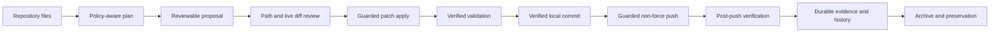

# Autonomous Forge

Autonomous Forge is an open-source, local-first Python CLI built through an AI software-stewardship experiment. It is a **pre-alpha, human-in-the-loop maintenance safety framework**, not an unattended AI engineer.

The repository does not call an AI model itself. External agents supply autonomy; Forge supplies repository planning, policy checks, guarded side-effect gates, Git verification, and durable maintenance evidence.

## What it does

```mermaid
flowchart LR
    A[Repository files] --> B[Policy-aware plan]
    B --> C[Reviewable proposal]
    C --> D[Path and live diff review]
    D --> E[Guarded patch apply]
    E --> F[Verified validation]
    F --> G[Verified local commit]
    G --> H[Guarded non-force push]
    H --> I[Post-push verification]
    I --> J[Durable evidence and history]
    J --> K[Archive and preservation]
```

Forge keeps review stages separate from stages that can change files, run commands, commit, push, or persist evidence. Side effects require explicit confirmation at the relevant boundary.

## Main capabilities

### Policy-aware planning

`forge plan` reads the repository roadmap, policy, state, and documented project files; selects the highest-priority eligible task; identifies allowed/prohibited areas; and emits a concrete reviewable plan with expected files, validation steps, risks, and reasons. It is local-first and read-only.

### Review and guarded change

Forge can build change proposals and validation plans, review planned paths against policy, inspect supplied or live tracked Git diffs, reject path escapes and malformed evidence, apply a confirmed replacement, verify the resulting target-scoped live diff, roll back on verification failure, and execute exact retained validation commands with bounded `shell=False` subprocesses.

### Verified maintenance chain

The connected workflow now includes:

- `forge verified-change-apply-run`: guarded replacement write → live-diff verification → retained validations → optional verified local commit, with separate apply/validation/commit confirmations.
- `forge verified-push-run`: verified commit → trust/status/protection readiness → separately confirmed fast-forward push → post-push verification.
- `forge verified-maintenance-run`: post-push-verified evidence → canonical durable bundle → `.ai/run-history/` link, with separate persistence confirmations.
- `forge verified-full-maintenance-run`: composes the full guarded preview/apply → validation → commit → push → post-push → durable-history lifecycle in one invocation while preserving independent authority gates for every side effect. It can derive patch readiness and change readiness in memory from existing reviewed evidence, generate the patch preview fresh from the current target/replacement, or consume the legacy persisted evidence path.

The underlying planning, diff review, patch, validation, commit, push, replay, archive, package, and preservation commands remain independently usable and reviewable.

## Evidence and preservation

Forge supports SHA-linked maintenance bundles, run-history records, replay/reviewer handoffs, archive manifests, copied archive roots, `.tar`/`.tar.gz`/`.zip` packaging, package verification, and preservation-completeness checks. Durable maintenance bundle outputs and run-history links are immutable through their normal writers once created; a later run must choose a new output path rather than silently clobber preserved evidence. Validation-result attachments are single-assignment: once a run-history record contains validation evidence, `forge validation-result-write` refuses to replace it with a contradictory later observation. First-time validation attachment now uses a flushed same-directory temporary file plus atomic replacement and refuses stale source bytes, reducing the risk of truncated durable history or overwriting a concurrently changed record.

## Testing and CI

The repository workflow targets Python **3.10, 3.11, and 3.12**. It installs the package, compiles source, smoke-tests the installed CLI, validates the roadmap, and runs pytest.

AUTO-141/AUTO-142 were dedicated baseline-recovery milestones. Subsequent work connected live diff review, guarded patching, validation, commit verification, non-force push, post-push verification, and durable evidence into one maintenance workflow.

There is still no dedicated lint, type-check, coverage, or release workflow, and there are no tagged releases.

## Safety boundary

Positive controls include repository path/symlink containment, policy-aware path checks, simple secret-marker checks, explicit confirmations for every side effect, bounded `shell=False` command execution, rollback after failed post-write diff verification, SHA-256 evidence binding, complete retained-validation coverage before commit readiness, exact changed-path commit verification, fast-forward-only non-force push behavior, no tag pushes or remote/protection mutation, post-push reachability verification, durable evidence hashing, refusal to overwrite existing durable bundle/history outputs, refusal to replace previously recorded validation evidence, stale-source refusal for first-time validation attachments, and atomic final replacement for that validation-record write.

Important limitations remain:

- live diff review covers tracked changes, not untracked files;
- passing configured validation commands does not prove those commands are sufficient for correctness;
- commit-trust, commit-status, and branch-protection inputs are still caller-supplied evidence rather than independently acquired fresh GitHub proof;
- post-push verification relies on local remote-tracking refs unless fetch is explicitly requested;
- hashes detect byte drift but do not prove signer identity;
- secret detection is not a full secret scanner;
- there is no shared lock for external scheduled agents or multi-process validation-result writers;
- Forge is not ready for unattended use on important repositories.

## Project memory

The `.ai` directory is the repository's engineering memory:

- `.ai/AUTONOMOUS_PLAN.md`
- `.ai/AUTONOMOUS_STATE.md`
- `.ai/AUTONOMOUS_CHANGELOG.md`
- `.ai/DECISIONS.md`

Historical branches and pull requests are inspect-before-integrate evidence only. Current stewardship works directly on `main` and does not create replacement PRs.

## Current Autonomous Status

Latest stewardship run: **AUTO-167 — make validation-result attachment writes atomic**.

- **Changed:** the first confirmed `forge validation-result-write` attachment now stages the complete JSON in a same-directory temporary file, flushes and `fsync`s it, then uses atomic `os.replace`. The writer also rechecks the source record bytes immediately before replacement and refuses a stale attachment when another writer changed the record during payload construction.
- **Safety:** AUTO-166 single-assignment behavior remains intact. A simulated final replace failure leaves the original record bytes untouched and cleans the temporary file; detected concurrent source changes are preserved rather than overwritten. Existing `.ai/run-history/` confinement, schema/result checks, retained context, and explicit `--confirm-write` are unchanged. No network/external-service access, force-push, tag push, remote/protection mutation, or workflow mutation was added.
- **Branch/PR disposition:** work stayed on `main`. Historical branches remain stale or superseded; reviewed PRs are merged/closed/obsolete and none contains newer relevant work.
- **Validation:** changed source and focused AUTO-167 regression tests were syntax-checked in the available scratch environment. Focused tests cover atomic-replace failure preservation/temp cleanup and stale-source refusal. The push-triggered Python 3.10/3.11/3.12 matrix is inspected when observable; no green result is claimed without evidence.
- **Visual updates:** none; this is a persistence-integrity hardening of an existing evidence stage, so the lifecycle diagram remains accurate.
- **Current limitations:** the byte recheck is not a shared multi-process lock, and first-time validation attachment still mutates the selected history record by explicit design. Fresh commit-trust/status/protection acquisition remains policy-gated.
- **Next autonomous objective:** inspect AUTO-167 CI first; if green, continue the same end-to-end milestone by eliminating the remaining in-place validation-record mutation or closing the next concrete provenance/persistence integrity gap.
