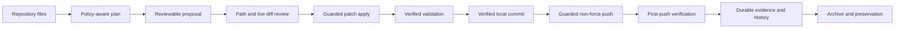

# Autonomous Forge

Autonomous Forge is an open-source, local-first Python CLI built through an AI software-stewardship experiment. It is a **pre-alpha, human-in-the-loop maintenance safety framework**, not an unattended AI engineer.

The repository does not call an AI model itself. External agents supply autonomy; Forge supplies repository planning, policy checks, guarded side-effect gates, Git verification, and durable maintenance evidence.

## What it does

```mermaid
flowchart LR
    A[Repository files] --> B[Policy-aware plan]
    B --> C[Reviewable proposal]
    C --> D[Path and live diff review]
    D --> E[Guarded patch apply]
    E --> F[Verified validation]
    F --> G[Verified local commit]
    G --> H[Guarded non-force push]
    H --> I[Post-push verification]
    I --> J[Durable evidence and history]
    J --> K[Archive and preservation]
```

Forge keeps review stages separate from stages that can change files, run commands, commit, push, or persist evidence. Side effects require explicit confirmation at the relevant boundary.

## Main capabilities

### Policy-aware planning

`forge plan` reads the repository roadmap, policy, state, and documented project files; selects the highest-priority eligible task; identifies allowed/prohibited areas; and emits a concrete reviewable plan with expected files, validation steps, risks, and reasons. It is local-first and read-only.

### Review and guarded change

Forge can build change proposals and validation plans, review planned paths against policy, inspect supplied or live tracked Git diffs, reject path escapes and malformed evidence, apply a confirmed replacement, verify the resulting target-scoped live diff, roll back on verification failure, and execute exact retained validation commands with bounded `shell=False` subprocesses. Guarded patch replacement is prepared in a same-directory temporary file, fsynced, atomically switched into place, and followed by a parent-directory fsync; immediately before apply and rollback Forge rechecks the target text against the exact bytes that authorized that write so stale concurrent edits are refused rather than overwritten.

### Verified maintenance chain

The connected workflow now includes:

- `forge verified-change-apply-run`: guarded replacement write → live-diff verification → retained validations → optional verified local commit, with separate apply/validation/commit confirmations.
- `forge verified-push-run`: verified commit → trust/status/protection readiness → separately confirmed fast-forward push → post-push verification.
- `forge verified-maintenance-run`: post-push-verified evidence → canonical durable bundle → `.ai/run-history/` link, with separate persistence confirmations.
- `forge verified-full-maintenance-run`: composes the full guarded preview/apply → validation → commit → push → post-push → durable-history lifecycle in one invocation while preserving independent authority gates for every side effect. It can derive patch readiness and change readiness in memory from existing reviewed evidence, generate the patch preview fresh from the current target/replacement, or consume the legacy persisted evidence path.

After all retained validation commands pass, verified change orchestration hashes the exact target bytes into commit-readiness evidence. Verified commit creation re-hashes that target immediately before staging and refuses the commit if the file changed after validation. After staging, Forge hashes the exact index bytes for the target and requires that staged SHA-256 to match the validated target digest before `git commit` can run. It also inspects the complete NUL-delimited staged path set and requires it to exactly equal the reviewed paths, preventing unrelated pre-staged files from entering the commit. Forge binds the commit to the exact reviewed parent `HEAD`: it captures that parent before staging, rechecks `HEAD` immediately before commit creation, and refuses to commit if the branch moved. After Git creates the commit, Forge verifies the target bytes, exact changed paths, and created commit parent before the commit can be marked verified.

The underlying planning, diff review, patch, validation, commit, push, replay, archive, package, and preservation commands remain independently usable and reviewable.

## Evidence and preservation

Forge supports SHA-linked maintenance bundles, run-history records, replay/reviewer handoffs, archive manifests, copied archive roots, `.tar`/`.tar.gz`/`.zip` packaging, package verification, preservation-completeness checks, and immutable preservation receipts. Durable verified-full-maintenance push evidence, maintenance bundle outputs, maintenance history links, preservation receipts, confirmed archive manifests, primary run-history records, copied archive entries, and archive packages refuse silent overwrite through their normal writers; a later run must choose a new output path rather than clobber preserved evidence. Verified-full-maintenance push-evidence publication, maintenance bundle publication, maintenance history-link publication, archive-manifest publication, primary run-history publication, archive-copy publication, and archive-package publication use same-directory temporary files plus no-clobber publication and parent-directory `fsync`, closing races between output preflight and the final durable write. Archive-copy publication additionally rechecks the copied byte count and SHA-256 against the verified preview before exposing each final destination, while archive packages are fully constructed and fsynced before publication so package-construction failures do not leave partial final artifacts.

For externally supplied validation observations, new workflows can use `forge validation-result-attachment-write` to create a separate immutable JSON sidecar under `.ai/run-history/validation-attachments/`. The sidecar leaves the original run-history record byte-for-byte unchanged, binds itself to that exact source with SHA-256 and byte count, refuses overwrite/path escape/stale source bytes, and can be re-verified against later source drift. `forge run-history-read` performs a bounded non-recursive discovery pass and surfaces verified sidecars that explicitly bind to the selected source record while preserving legacy `run-history/v1` fields unchanged. `forge maintenance-replay-summary --validation-record ...` carries verified sidecars into replay output as fingerprinted **external advisory provenance**. `forge maintenance-evidence-bundle --validation-record ...` persists that same verified provenance class in the durable bundle itself, and confirmed maintenance history links retain a compact SHA-256-bound summary of that block so consumers can discover advisory provenance without opening the full bundle. `forge maintenance-history-link-review --verify-linked-bundle` validates a present compact summary against the actual linked bundle provenance, including its deterministic SHA-256, source record, attachment count, and fixed advisory/non-executor semantics. `forge maintenance-review-handoff` and `forge maintenance-review-compare` carry that verified result into reviewer-facing handoffs and preservation candidates without making it a readiness gate or preservation-ranking signal. `forge maintenance-archive-manifest` promotes the selected candidate's same advisory summary to a first-class archive-manifest field. `forge maintenance-archive-copy-verify`, package preview, and `forge maintenance-archive-package-verify` carry the same summary through copied-root and packaged-evidence review. `forge maintenance-preservation-completeness` now exposes that summary at the final preservation boundary and reports whether the normalized provenance remained consistent across the written manifest, copied-root verification, and package verification. Retained validation context must agree with the bundle, and external observations are always marked as not equivalent to executor-produced validation proof and cannot affect bundle or preservation completeness. The historical in-place `forge validation-result-write` remains available for backward compatibility. `forge maintenance-preservation-receipt` can bind one already-complete preservation artifact into a compact immutable receipt under `.ai/preservation-receipts/`; receipt verification recomputes the exact completeness byte count and SHA-256 instead of re-running lower-level archive gates. Its `--discover` mode performs a bounded local review of receipts bound to a chosen complete artifact, surfaces verified and invalid candidates, and remains informational only: receipt presence or absence never changes preservation completeness. `forge maintenance-review-compare --completeness ...` reuses that same discovery contract to show receipt state next to matching handoffs and preservation candidates without changing comparison readiness or candidate ranking. Equivalent completeness paths are canonicalized and deduplicated inside the comparison builder itself, so CLI and direct Python callers cannot inflate receipt counts with repeated relative, dotted-relative, absolute, or symlink-resolved references to the same artifact.

## Testing and CI

The repository workflow targets Python **3.10, 3.11, and 3.12**. It installs the package, compiles source, smoke-tests the installed CLI, validates the roadmap, and runs pytest.

AUTO-141/AUTO-142 were dedicated baseline-recovery milestones. Subsequent work connected live diff review, guarded patching, validation, commit verification, non-force push, post-push verification, and durable evidence into one maintenance workflow.

There is still no dedicated lint, type-check, coverage, or release workflow, and there are no tagged releases.

## Safety boundary

Positive controls include repository path/symlink containment, policy-aware path checks, simple secret-marker checks, explicit confirmations for every side effect, bounded `shell=False` command execution, atomic/fsynced guarded patch replacement with stale-target refusal on both apply and rollback after failed post-write diff verification, SHA-256 evidence binding, complete retained-validation coverage before commit readiness, exact target-byte SHA-256 binding after successful validation with mandatory pre-stage working-tree, post-stage index, exact staged-path-set, reviewed-parent HEAD, and post-commit target/parent/path checks, exact changed-path commit verification, fast-forward-only non-force push behavior, no tag pushes or remote/protection mutation, post-push reachability verification, durable evidence hashing, refusal to overwrite existing durable bundle/history/package outputs, durable no-clobber verified-push/maintenance-bundle/history-link/run-history/archive-manifest/archive-copy/archive-package publication with file and parent-directory fsync, archive-copy source-byte/SHA continuity checks before final publication, refusal to replace previously recorded validation evidence, immutable hash-bound validation sidecars for new external observations, stale-source refusal, atomic/no-clobber persistence, parent-directory fsync after durable validation evidence publication, bounded fail-closed attachment verification in the primary run-history reader, advisory-only replay carriage for externally supplied validation observations, advisory-only durable-bundle carriage for those same observations, compact hash-bound advisory-provenance summaries in maintenance history links, linked-bundle verification that fails closed when a present compact summary disagrees with the full advisory provenance block, reviewer-facing handoff/comparison propagation that preserves advisory semantics without changing readiness or ranking, archive-manifest propagation that preserves those same fixed advisory semantics without changing manifest readiness or archive-integrity scoring, copied-root/package propagation that keeps advisory provenance visible without changing copy/package readiness or integrity results, final preservation-completeness reporting that verifies cross-layer advisory-provenance continuity without turning external observations into a preservation gate, explicitly confirmed immutable preservation receipts that bind to exact completeness artifact bytes without duplicating archive verification, bounded informational receipt discovery that independently requires a complete source artifact and never treats receipt existence as preservation proof, higher-level comparison receipt review that reuses the same receipt verifier while remaining outside readiness and ranking scores, and core-level canonical-path deduplication of comparison completeness inputs so the same evidence file cannot be counted more than once regardless of whether the caller is the CLI or Python API.

Important limitations remain:

- live diff review covers tracked changes, not untracked files;
- passing configured validation commands does not prove those commands are sufficient for correctness;
- commit-trust, commit-status, and branch-protection inputs are still caller-supplied evidence rather than independently acquired fresh GitHub proof;
- post-push verification relies on local remote-tracking refs unless fetch is explicitly requested;
- hashes detect byte drift but do not prove signer identity;
- secret detection is not a full secret scanner;
- there is no shared lock for external scheduled agents or multi-process validation-result writers;
- immutable validation sidecars are visible through `run-history-read`, replay, durable bundle construction, maintenance history-link summaries, linked-bundle history review, reviewer handoff/comparison surfaces, archive-manifest preview/write/verification surfaces, copied-root verification, package preview/verification surfaces, and final preservation-completeness summaries, but remain externally supplied observations and are never promoted to executor-produced validation evidence;
- legacy history links/manifests without the compact external-validation summary remain compatible, so absence of the summary is reported rather than treated as corruption;
- preservation-receipt discovery and reviewer comparison receipt annotations are intentionally informational and do not make a receipt mandatory for an otherwise complete preservation artifact or change candidate ranking;
- no-clobber durable publication relies on ordinary same-filesystem hard-link support;
- archive-copy publication is per-file rather than a cross-file transaction, so a later-entry failure can leave earlier verified entries durably published for inspection;
- atomic patch replacement preserves the target permission mode but intentionally does not promise preservation of every filesystem metadata field; stale-target checks reduce but do not eliminate the narrow race between the final comparison and `os.replace`; a parent-directory fsync failure after replacement means the target has already changed and must be inspected before retrying;
- validation-to-commit target hashing verifies working-tree bytes before staging, exact staged index bytes afterward, the complete staged path set, the reviewed parent `HEAD` before and immediately before commit creation, the exact parent of the created commit, and the exact target bytes and changed paths stored in the created commit. These are fail-closed checks rather than a shared Git index/ref lock, so an extremely narrow concurrent index/ref mutation may still create a commit; such a commit is detected and reported as `created_unverified` rather than silently accepted;
- Forge is not ready for unattended use on important repositories.

## Project memory

The `.ai` directory is the repository's engineering memory:

- `.ai/AUTONOMOUS_PLAN.md`
- `.ai/AUTONOMOUS_STATE.md`
- `.ai/AUTONOMOUS_CHANGELOG.md`
- `.ai/DECISIONS.md`

Historical branches and pull requests are inspect-before-integrate evidence only. Current stewardship works directly on `main` and does not create replacement PRs.

## Current Autonomous Status

Latest stewardship run: **AUTO-196 — refuse unreviewed staged paths before commit creation**.

- **Changed:** after staging the reviewed paths and verifying the exact target index bytes, verified commit creation now runs NUL-delimited `git diff --cached --name-only -z --`, records the complete staged path set, and requires it to exactly equal the reviewed paths before `git commit` is allowed.
- **Why:** prior releases verified the commit's exact changed paths only after the commit existed. An unrelated file that was already staged could therefore be included by ordinary `git commit`, producing a created-but-unverified commit instead of preventing the unsafe commit.
- **Safety:** unreviewed or missing staged paths now block before commit creation. Existing target-byte hashing, reviewed-parent binding, explicit commit confirmation, hooks, post-commit verification, non-force push behavior, and no remote/protection mutation guarantees remain intact.
- **Branch/PR disposition:** work stayed directly on `main`; all seven non-main branches remain historical/diverged and recent PRs are merged, closed, obsolete, or unrelated. No branch or PR was created or merged.
- **Validation:** deterministic regression coverage now includes an unrelated staged path that must block before `git commit`, and existing verified-commit/parent-binding test doubles were updated for the new staged-path inspection. Direct clone/full pytest remains unavailable because this runtime cannot resolve `github.com`; the Python 3.10/3.11/3.12 matrix is not claimed green without observable CI evidence.
- **Visual updates:** none; this is an integrity gate inside the existing verified-commit stage, so the lifecycle diagram remains accurate.
- **Current limitations:** the path-set check is fail-closed but is not a shared Git index lock. Another process can still mutate the index after the staged-path check; post-commit exact-path verification remains the final detection boundary for that narrower race.
- **Next autonomous objective:** inspect AUTO-196 CI when observable; any failure takes priority. If green, continue only with another concrete cross-stage integrity defect or a meaningful caller-managed evidence-handoff reduction.
