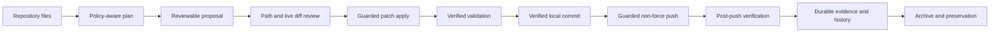

# Autonomous Forge

Autonomous Forge is an open-source, local-first Python CLI built through an AI software-stewardship experiment. It is a **pre-alpha, human-in-the-loop maintenance safety framework**, not an unattended AI engineer.

The repository does not call an AI model itself. External agents supply autonomy; Forge supplies repository planning, policy checks, guarded side-effect gates, Git verification, and durable maintenance evidence.

## What it does

```mermaid
flowchart LR
    A[Repository files] --> B[Policy-aware plan]
    B --> C[Reviewable proposal]
    C --> D[Path and live diff review]
    D --> E[Guarded patch apply]
    E --> F[Verified validation]
    F --> G[Verified local commit]
    G --> H[Guarded non-force push]
    H --> I[Post-push verification]
    I --> J[Durable evidence and history]
    J --> K[Archive and preservation]
```

Forge keeps review stages separate from stages that can change files, run commands, commit, push, or persist evidence. Side effects require explicit confirmation at the relevant boundary.

## Main capabilities

### Policy-aware planning

`forge plan` reads the repository roadmap, policy, state, and documented project files; selects the highest-priority eligible task; identifies allowed/prohibited areas; and emits a concrete reviewable plan with expected files, validation steps, risks, and reasons. It is local-first and read-only.

### Review and guarded change

Forge can build change proposals and validation plans, review planned paths against policy, inspect supplied or live tracked Git diffs, reject path escapes and malformed evidence, apply confirmed replacements with stale-target protection, verify resulting diffs, and execute retained validation commands with bounded `shell=False` subprocesses.

### Verified maintenance chain

The connected workflow includes guarded replacement → live-diff verification → retained validation → optional verified local commit → trust/status/protection readiness → separately confirmed fast-forward push → post-push verification → durable maintenance evidence and history. The higher-level `forge verified-full-maintenance-run` composes that lifecycle while keeping independent authority gates for side effects.

Verified commit creation isolates staging through a private temporary Git index, binds reviewed target bytes and changed paths to the expected parent, refuses unrelated shared staging, and rechecks reviewed state before and after commit synchronization. Push execution is non-force and explicitly confirmed, and post-push verification remains separate.

## Evidence and preservation

Forge supports SHA-linked maintenance bundles, run-history records, replay/reviewer handoffs, archive manifests, copied archive roots, `.tar`/`.tar.gz`/`.zip` packages, package verification, preservation-completeness checks, and immutable preservation receipts.

Durable writers use repository confinement, explicit confirmation, no-clobber publication, file/directory `fsync`, SHA-256 binding, and fail-closed verification. Archive hashing and package member verification stream in bounded chunks instead of materializing complete evidence files in memory.

Recent preservation hardening includes:

- archive manifests bind selected evidence, including run-history-link bytes where authoritative digests exist;
- archive copy/package verification hashes content incrementally and rejects byte-count or digest drift;
- archive manifests and archive packages are immediately reverified after publication;
- failed or Python-interrupted verification rolls back only bytes still owned by the current invocation;
- archive-package and archive-copy publication now perform ownership-checked rollback when parent-directory durability sync fails after publication;
- preservation-receipt verification and discovery use bounded input/candidate limits and remain informational rather than readiness gates;
- externally supplied validation sidecars remain advisory provenance and are never promoted into executor-produced validation authority.

AUTO-239 closes the equivalent archive-copy durability-sync failure gap left after AUTO-238 hardened package publication. If an individual copied destination has been published but its parent-directory `fsync` fails, Forge hashes the current destination and removes it only when it still matches the exact copied bytes produced by this invocation. The rollback directory is then fsynced. If another writer changed the destination, Forge preserves those bytes and fails closed rather than deleting potentially foreign data.

See `docs/ARCHIVE_COPY_DURABILITY_ROLLBACK.md` for that contract and its limits.

## Testing and CI

The repository workflow targets Python **3.10, 3.11, and 3.12**. It installs the package, compiles source, smoke-tests the installed CLI, validates the roadmap, and runs pytest.

There is still no dedicated lint, type-check, coverage, or release workflow, and there are no tagged releases.

## Safety boundary

Important controls include repository path/symlink containment, policy-aware path checks, explicit confirmations for side effects, bounded local subprocesses, stale-target refusal, SHA-256 evidence binding, private-index commit isolation, fast-forward-only non-force push behavior, post-push verification, no-clobber durable publication, bounded-memory archive hashing, and ownership-checked rollback of newly published archive evidence.

Important limitations remain:

- live diff review covers tracked changes, not untracked files;
- passing configured validation commands does not prove those commands are sufficient for correctness;
- hashes prove byte continuity, not signer identity;
- secret detection is not a full secret scanner;
- no filesystem-level lock can permanently prevent later evidence mutation;
- Python cleanup cannot run after abrupt termination such as `SIGKILL`, host failure, interpreter crash, or power loss;
- a filesystem that fails both publication and rollback directory sync leaves durability uncertain and requires inspection;
- archive-copy publication is per-file rather than a cross-file transaction;
- no-clobber durable publication relies on ordinary same-filesystem hard-link support;
- Forge is not ready for unattended use on important repositories.

## Project memory

The `.ai` directory is the repository's engineering memory:

- `.ai/AUTONOMOUS_PLAN.md`
- `.ai/AUTONOMOUS_STATE.md`
- `.ai/AUTONOMOUS_CHANGELOG.md`
- `.ai/DECISIONS.md`

Historical branches and pull requests are inspect-before-integrate evidence only. Current stewardship works directly on `main` and does not create replacement PRs.

## Current Autonomous Status

Latest stewardship run: **AUTO-239 — roll back archive copies when publication durability sync fails**.

- **Changed:** archive-copy no-clobber publication now treats parent-directory `fsync` failure after an individual destination is linked as a failed publication and performs SHA-256 ownership-checked rollback. Unchanged owned bytes are removed and the directory is fsynced again; bytes changed after publication are preserved for inspection.
- **Why:** the package writer already had this protection after AUTO-238, but the archive-copy helper still raised after directory-sync failure while leaving the just-published destination visible. AUTO-239 closes that concrete durability ambiguity without adding a new command or authority surface.
- **Validation:** deterministic tests cover clean rollback after a synthetic first directory-sync failure and the racing-mutation case that must preserve changed destination bytes. GitHub Actions validation on the completed `main` head is required before this cycle is reported complete.
- **Safety:** explicit confirmation, repository containment, bounded-memory hashing, source byte/SHA checks, same-directory temporary copies, no-clobber hard-link publication, and per-file copy semantics remain intact. No network, workflow-control, Git commit/push, force-push, overwrite, remote, or branch-protection authority was added.
- **Branch/PR disposition:** all seven non-main branches were compared with current `main`; every one is heavily behind/diverged and contains historical or already-integrated work. There are no open PRs. Open issues #1, #6, and #9 are broader product/discussion requests rather than a release blocker, so nothing was integrated or closed this run.
- **Visual updates:** none; archive/preservation topology did not change, only the existing archive-copy publication failure contract became safer.
- **Current limitations:** rollback depends on Python cleanup executing, rollback-directory `fsync` can itself fail, and archive copying remains deliberately per-file rather than transactional across the whole manifest.
- **Next autonomous objective:** inspect the remaining durable evidence writers—especially validation-result and attachment publication—for a confirmed post-publication durability failure or direct-call integrity gap; any fresh CI failure takes priority.
