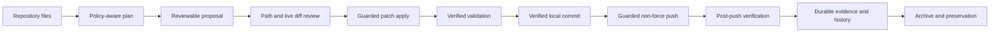

# Autonomous Forge

Autonomous Forge is an open-source, local-first Python CLI built through an AI software-stewardship experiment. It is a **pre-alpha, human-in-the-loop maintenance safety framework**, not an unattended AI engineer.

The repository does not call an AI model itself. External agents supply autonomy; Forge supplies repository planning, policy checks, guarded side-effect gates, Git verification, and durable maintenance evidence.

## What it does

```mermaid
flowchart LR
    A[Repository files] --> B[Policy-aware plan]
    B --> C[Reviewable proposal]
    C --> D[Path and live diff review]
    D --> E[Guarded patch apply]
    E --> F[Verified validation]
    F --> G[Verified local commit]
    G --> H[Guarded non-force push]
    H --> I[Post-push verification]
    I --> J[Durable evidence and history]
    J --> K[Archive and preservation]
```

Forge keeps review stages separate from stages that can change files, run commands, commit, push, or persist evidence. Side effects require explicit confirmation at the relevant boundary.

## Main capabilities

### Policy-aware planning

`forge plan` reads the repository roadmap, policy, state, and documented project files; selects the highest-priority eligible task; identifies allowed/prohibited areas; and emits a concrete reviewable plan with expected files, validation steps, risks, and reasons. It is local-first and read-only.

### Review and guarded change

Forge can build change proposals and validation plans, review planned paths against policy, inspect supplied or live tracked Git diffs, reject path escapes and malformed evidence, apply a confirmed replacement, verify the resulting target-scoped live diff, roll back on verification failure, and execute exact retained validation commands with bounded `shell=False` subprocesses.

### Verified maintenance chain

The connected workflow now includes:

- `forge verified-change-apply-run`: guarded replacement write → live-diff verification → retained validations → optional verified local commit, with separate apply/validation/commit confirmations.
- `forge verified-push-run`: verified commit → trust/status/protection readiness → separately confirmed fast-forward push → post-push verification.
- `forge verified-maintenance-run`: post-push-verified evidence → canonical durable bundle → `.ai/run-history/` link, with separate persistence confirmations.
- `forge verified-full-maintenance-run`: composes the full guarded preview/apply → validation → commit → push → post-push → durable-history lifecycle in one invocation while preserving independent authority gates for every side effect. It can derive patch readiness and change readiness in memory from existing reviewed evidence, generate the patch preview fresh from the current target/replacement, or consume the legacy persisted evidence path.

The underlying planning, diff review, patch, validation, commit, push, replay, archive, package, and preservation commands remain independently usable and reviewable.

## Evidence and preservation

Forge supports SHA-linked maintenance bundles, run-history records, replay/reviewer handoffs, archive manifests, copied archive roots, `.tar`/`.tar.gz`/`.zip` packaging, package verification, and preservation-completeness checks. Durable maintenance bundle outputs and run-history links are immutable through their normal writers once created; a later run must choose a new output path rather than silently clobber preserved evidence.

For externally supplied validation observations, new workflows can use `forge validation-result-attachment-write` to create a separate immutable JSON sidecar under `.ai/run-history/validation-attachments/`. The sidecar leaves the original run-history record byte-for-byte unchanged, binds itself to that exact source with SHA-256 and byte count, refuses overwrite/path escape/stale source bytes, and can be re-verified against later source drift. `forge run-history-read` performs a bounded non-recursive discovery pass and surfaces verified sidecars that explicitly bind to the selected source record while preserving legacy `run-history/v1` fields unchanged. `forge maintenance-replay-summary --validation-record ...` carries verified sidecars into replay output as fingerprinted **external advisory provenance**. `forge maintenance-evidence-bundle --validation-record ...` can now persist that same verified provenance class in the durable bundle itself. Retained validation context must agree with the bundle, and external observations are always marked as not equivalent to executor-produced validation proof and cannot affect bundle completeness. The historical in-place `forge validation-result-write` remains available for backward compatibility.

## Testing and CI

The repository workflow targets Python **3.10, 3.11, and 3.12**. It installs the package, compiles source, smoke-tests the installed CLI, validates the roadmap, and runs pytest.

AUTO-141/AUTO-142 were dedicated baseline-recovery milestones. Subsequent work connected live diff review, guarded patching, validation, commit verification, non-force push, post-push verification, and durable evidence into one maintenance workflow.

There is still no dedicated lint, type-check, coverage, or release workflow, and there are no tagged releases.

## Safety boundary

Positive controls include repository path/symlink containment, policy-aware path checks, simple secret-marker checks, explicit confirmations for every side effect, bounded `shell=False` command execution, rollback after failed post-write diff verification, SHA-256 evidence binding, complete retained-validation coverage before commit readiness, exact changed-path commit verification, fast-forward-only non-force push behavior, no tag pushes or remote/protection mutation, post-push reachability verification, durable evidence hashing, refusal to overwrite existing durable bundle/history outputs, refusal to replace previously recorded validation evidence, immutable hash-bound validation sidecars for new external observations, stale-source refusal, atomic/no-clobber persistence, parent-directory fsync after durable validation evidence publication, bounded fail-closed attachment verification in the primary run-history reader, advisory-only replay carriage for externally supplied validation observations, and advisory-only durable-bundle carriage for those same observations.

Important limitations remain:

- live diff review covers tracked changes, not untracked files;
- passing configured validation commands does not prove those commands are sufficient for correctness;
- commit-trust, commit-status, and branch-protection inputs are still caller-supplied evidence rather than independently acquired fresh GitHub proof;
- post-push verification relies on local remote-tracking refs unless fetch is explicitly requested;
- hashes detect byte drift but do not prove signer identity;
- secret detection is not a full secret scanner;
- there is no shared lock for external scheduled agents or multi-process validation-result writers;
- immutable validation sidecars are visible through `run-history-read`, replay, and durable bundle construction, but remain externally supplied observations and are never promoted to executor-produced validation evidence;
- Forge is not ready for unattended use on important repositories.

## Project memory

The `.ai` directory is the repository's engineering memory:

- `.ai/AUTONOMOUS_PLAN.md`
- `.ai/AUTONOMOUS_STATE.md`
- `.ai/AUTONOMOUS_CHANGELOG.md`
- `.ai/DECISIONS.md`

Historical branches and pull requests are inspect-before-integrate evidence only. Current stewardship works directly on `main` and does not create replacement PRs.

## Current Autonomous Status

Latest stewardship run: **AUTO-172 — persist immutable validation provenance in durable maintenance bundles**.

- **Changed:** extended the existing `forge maintenance-evidence-bundle` command with optional `--validation-record`. Verified immutable validation sidecars are discovered through the bounded run-history reader, checked against the exact source record, fingerprinted, context-checked against the bundle, and persisted under `external_validation_evidence` before the existing confirmed bundle write.
- **Safety:** this provenance is explicitly `externally_supplied_observation`, `executor_validation_equivalent: false`, and `bundle_gate_effect: advisory_only`. It never satisfies the executor-produced validation stage, removes blockers, changes `bundle_status`, or converts an incomplete evidence chain into a complete one. Existing bundle-write/history-link confirmations and overwrite refusal remain unchanged.
- **Branch/PR disposition:** work stayed on `main`. Historical branches remain stale or superseded; reviewed PRs are merged/closed/obsolete or unrelated and none warranted integration.
- **Validation:** focused deterministic coverage was added for successful advisory provenance, SHA-256 fingerprinting, validation-context drift refusal, and CLI parsing. Direct full-checkout pytest is unavailable because this runtime cannot resolve `github.com`; the pushed head's GitHub status is checked separately and no green matrix claim is made without evidence.
- **Visual updates:** none; this strengthens provenance inside the existing durable-evidence stage and does not change the lifecycle architecture.
- **Current limitations:** external observations remain advisory and do not prove Forge executed validation. The history-link schema does not yet summarize the external provenance block, and fresh commit-trust/status/protection acquisition remains policy-gated.
- **Next autonomous objective:** inspect AUTO-172 CI when observable; if green, preserve a compact hash-bound summary of the bundle's external validation provenance in the maintenance history link so durable consumers can discover it without opening the full bundle.