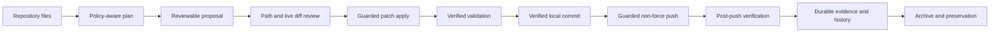

# Autonomous Forge

Autonomous Forge is an open-source, local-first Python CLI built through an AI software-stewardship experiment. It is a **pre-alpha, human-in-the-loop maintenance safety framework**, not an unattended AI engineer.

The repository does not call an AI model itself. External agents supply autonomy; Forge supplies repository planning, policy checks, guarded side-effect gates, Git verification, and durable maintenance evidence.

## What it does

```mermaid
flowchart LR
    A[Repository files] --> B[Policy-aware plan]
    B --> C[Reviewable proposal]
    C --> D[Path and live diff review]
    D --> E[Guarded patch apply]
    E --> F[Verified validation]
    F --> G[Verified local commit]
    G --> H[Guarded non-force push]
    H --> I[Post-push verification]
    I --> J[Durable evidence and history]
    J --> K[Archive and preservation]
```

Forge keeps review stages separate from stages that can change files, run commands, commit, push, or persist evidence. Side effects require explicit confirmation at the relevant boundary.

## Main capabilities

### Policy-aware planning

`forge plan` reads the repository roadmap, policy, state, and documented project files; selects the highest-priority eligible task; identifies allowed/prohibited areas; and emits a concrete reviewable plan with expected files, validation steps, risks, and reasons. It is local-first and read-only.

### Review and guarded change

Forge can build change proposals and validation plans, review planned paths against policy, inspect supplied or live tracked Git diffs, reject path escapes and malformed evidence, apply confirmed replacements with stale-target protection, verify resulting diffs, and execute retained validation commands with bounded `shell=False` subprocesses.

### Verified maintenance chain

The connected workflow includes guarded replacement → live-diff verification → retained validation → optional verified local commit → trust/status/protection readiness → separately confirmed fast-forward push → post-push verification → durable maintenance evidence and history. The higher-level `forge verified-full-maintenance-run` composes that lifecycle while keeping independent authority gates for side effects.

Verified commit creation isolates staging through a private temporary Git index, binds reviewed target bytes and changed paths to the expected parent, refuses unrelated shared staging, and rechecks reviewed state before and after commit synchronization. Push execution is non-force and explicitly confirmed, and post-push verification remains separate.

Executor handoff persistence keeps observed executor output reviewable before it becomes durable validation history. The reviewed executor-run JSON must stay inside the repository, be a real `.json` file, and is read through a strict 1,000,000-byte bound before UTF-8 and JSON parsing so the persistence bridge cannot consume an unbounded input file.

## Evidence and preservation

Forge supports SHA-linked maintenance bundles, run-history records, replay/reviewer handoffs, archive manifests, copied archive roots, `.tar`/`.tar.gz`/`.zip` packages, package verification, preservation-completeness checks, and immutable preservation receipts.

Durable writers use repository confinement, explicit confirmation, no-clobber publication, file/directory `fsync`, SHA-256 binding, and fail-closed verification. Archive hashing and package member verification stream in bounded chunks instead of materializing complete evidence files in memory.

Recent preservation hardening includes:

- archive manifests bind selected evidence, including run-history-link bytes where authoritative digests exist;
- archive copy/package verification hashes content incrementally and rejects byte-count or digest drift;
- archive manifests and archive packages are immediately reverified after publication;
- failed or Python-interrupted verification rolls back only bytes still owned by the current invocation;
- archive-manifest publication now also performs ownership-checked rollback when parent-directory durability sync fails after the no-clobber hard link succeeds;
- archive-package and archive-copy publication perform ownership-checked rollback when parent-directory durability sync fails after publication;
- immutable validation-result sidecar publication applies the same ownership-checked rollback rule when its parent-directory durability sync fails;
- the historical in-place validation-result writer restores the exact original run-history bytes when its post-replacement directory sync fails, but only while the current record still matches this invocation's replacement digest;
- immutable run-history publication removes its own unchanged record when the post-link parent-directory durability sync fails, while preserving a destination whose bytes changed before rollback;
- verified full-maintenance push-evidence publication removes its own unchanged JSON when the post-link parent-directory durability sync fails, while preserving a destination whose bytes changed before rollback;
- maintenance evidence bundle and history-link publication now use the same ownership-checked rollback rule after post-link parent-directory durability failure;
- immutable preservation-receipt publication now also removes only its own unchanged receipt when post-link parent-directory durability sync fails, and preserves a concurrently changed destination;
- preservation-receipt verification and discovery use bounded input/candidate limits and remain informational rather than readiness gates;
- externally supplied validation sidecars remain advisory provenance and are never promoted into executor-produced validation authority.

See `docs/EXECUTOR_HANDOFF_PERSISTENCE.md`, `docs/RUN_HISTORY_WRITES.md`, `docs/ARCHIVE_MANIFEST_DURABILITY_ROLLBACK.md`, `docs/PUSH_EVIDENCE_DURABILITY_ROLLBACK.md`, `docs/MAINTENANCE_EVIDENCE_DURABILITY_ROLLBACK.md`, and `docs/PRESERVATION_RECEIPT_DURABILITY_ROLLBACK.md` for the current write-integrity boundaries.

## Testing and CI

The repository workflow targets Python **3.10, 3.11, and 3.12**. It installs the package, compiles source, smoke-tests the installed CLI, validates the roadmap, and runs pytest.

There is still no dedicated lint, type-check, coverage, or release workflow, and there are no tagged releases.

## Safety boundary

Important controls include repository path/symlink containment, policy-aware path checks, explicit confirmations for side effects, bounded local subprocesses, bounded executor-handoff input, stale-target refusal, SHA-256 evidence binding, private-index commit isolation, fast-forward-only non-force push behavior, post-push verification, no-clobber durable publication, bounded-memory archive hashing, and ownership-checked rollback of newly published or replaced evidence.

Important limitations remain:

- live diff review covers tracked changes, not untracked files;
- passing configured validation commands does not prove those commands are sufficient for correctness;
- hashes prove byte continuity, not signer identity;
- secret detection is not a full secret scanner;
- no filesystem-level lock can permanently prevent later evidence mutation;
- Python cleanup cannot run after abrupt termination such as `SIGKILL`, host failure, interpreter crash, or power loss;
- a filesystem that fails both publication and rollback directory sync leaves durability uncertain and requires inspection;
- ownership-checked rollback still has a small cross-process race between its final digest check and deletion/replacement because Forge does not hold a shared filesystem lock;
- archive-copy publication is per-file rather than a cross-file transaction;
- no-clobber durable publication relies on ordinary same-filesystem hard-link support;
- Forge is not ready for unattended use on important repositories.

## Project memory

The `.ai` directory is the repository's engineering memory:

- `.ai/AUTONOMOUS_PLAN.md`
- `.ai/AUTONOMOUS_STATE.md`
- `.ai/AUTONOMOUS_CHANGELOG.md`
- `.ai/DECISIONS.md`

Historical branches and pull requests are inspect-before-integrate evidence only. Current stewardship works directly on `main` and does not create replacement PRs.

## Current Autonomous Status

Latest stewardship run: **AUTO-247 — archive manifest publication durability rollback**.

- **Changed:** the core archive-manifest no-clobber writer now SHA-256 binds the exact serialized manifest before hard-link publication. If the following parent-directory `fsync` fails, Forge removes the destination only while its bytes still match this invocation, then durability-syncs the directory again. A destination changed during the failure window is preserved instead of being deleted.
- **Why:** the previous writer could report persistence failure after the final manifest path had already been created, leaving ambiguous authoritative preservation evidence. AUTO-247 closes that concrete end-to-end write-integrity gap rather than adding another review-only command.
- **Validation:** deterministic regression tests cover rollback after a synthetic post-publication directory-sync failure and preservation of a destination changed by another writer during that failure window. The pushed final head is checked through the full Python 3.10/3.11/3.12 GitHub Actions workflow before this run is reported complete.
- **Safety:** explicit write confirmation, repository confinement, ready-manifest gating, no-clobber hard-link publication, same-directory temporary-file durability, and immediate post-publication manifest verification remain unchanged. Rollback is ownership-checked and refuses to delete changed bytes.
- **Branch/PR disposition:** all eight visible branches and current PR/issue history were inspected. The seven non-main branches remain historical/diverged, no open PR requires integration, and open issues #1, #6, and #9 remain broader product/discussion requests rather than blockers for this repair.
- **Visual updates:** none; workflow topology did not change, only the durability semantics of an existing archive-manifest write boundary became safer.
- **Current limitations:** Python cleanup cannot run after `SIGKILL`, host/interpreter failure, or power loss; a second directory-sync failure leaves durability uncertain; and there is still no shared filesystem lock to eliminate the narrow race after the final ownership digest check.
- **Next autonomous objective:** inspect the remaining durable evidence writers for another confirmed post-publication durability ambiguity, prioritizing authoritative maintenance evidence; any fresh CI failure takes priority.
