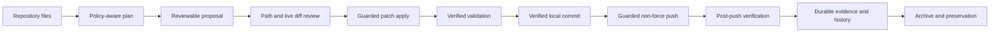

# Autonomous Forge

Autonomous Forge is an open-source, local-first Python CLI built through an AI software-stewardship experiment. It is best understood as a **pre-alpha, human-in-the-loop maintenance safety framework**, not an unattended AI engineer.

The repository does not call an AI model itself. External agents supplied the autonomy; Forge supplies repository planning, policy checks, guarded side-effect gates, Git verification, and durable maintenance evidence.

## What it does


```mermaid
flowchart LR
    A[Repository files] --> B[Policy-aware plan]
    B --> C[Reviewable proposal]
    C --> D[Path and live diff review]
    D --> E[Guarded patch apply]
    E --> F[Verified validation]
    F --> G[Verified local commit]
    G --> H[Guarded non-force push]
    H --> I[Post-push verification]
    I --> J[Durable evidence and history]
    J --> K[Archive and preservation]
```

Forge keeps the review stages separate from the stages that can change files, run commands, commit, push, or persist evidence. Side effects require explicit confirmation at the relevant boundary.

## Main capabilities

### Policy-aware planning

`forge plan` is the policy-aware planning milestone that started the product direction. It:

- reads the repository roadmap, policy, state, and documented project files;
- chooses the highest-priority eligible task;
- identifies allowed and prohibited file areas;
- produces a concrete reviewable implementation plan;
- lists expected files, validation steps, risks, and reasons;
- remains local-first and read-only.

### Review and guarded change

Forge can:

- build change proposals and validation plans;
- review planned paths against policy;
- inspect a supplied patch or the repository's current tracked diff relative to `HEAD`;
- reject path escapes, unsafe symlinks, malformed evidence, and context drift;
- apply a confirmed reviewed replacement and verify its actual target-scoped Git diff;
- restore the original target if post-write diff verification fails;
- execute exact retained validation commands with `shell=False` and bounded timeouts.

### Verified commit and push chain

The maintenance chain now includes:

- `forge verified-change-run`: executes every retained validation step, builds verified commit readiness, and can create and immediately verify the reviewed local commit. Validation and commit creation keep separate confirmations.
- `forge verified-push-run`: consumes a completed committed `verified-change-run` artifact, carries the verified commit through commit-trust, status, and branch-protection readiness, and can execute the existing guarded non-force push only with a **separate `--confirm-push` authority gate**. After a completed push it performs post-push remote verification; optional fetching is separately requested with `--fetch-after-push`.
- the underlying `verified-push-handoff`, `post-push-verify`, maintenance evidence, replay, archive, package, and preservation commands remain independently usable and reviewable.

A typical push-stage invocation is:

```bash
forge verified-push-run \
  --change-run .ai/evidence/verified-change-run.json \
  --commit-trust .ai/evidence/commit-trust.json \
  --status-review .ai/evidence/commit-status.json \
  --branch-protection .ai/evidence/branch-protection.json \
  --branch main \
  --remote origin \
  --confirm-push \
  --fetch-after-push \
  --require-post-push-verified \
  --format json
```

Without `--confirm-push`, the command can report `ready_for_push` but cannot treat validation or commit confirmation as push authority.

### Evidence and preservation

Forge also supports:

- evidence bundles with verified push/post-push provenance binding;
- hash-linked run-history records;
- replay summaries and reviewer handoffs;
- archive manifests and copied archive roots;
- `.tar`, `.tar.gz`, and `.zip` packaging;
- package verification and preservation-completeness checks;
- optional workflow-status freshness evidence.

## Development history

The project began as a tiny roadmap-driven CLI and grew into a connected maintenance framework. Major stages include:

| Stage | Result |
|---|---|
| `AUTO-001`–`AUTO-014` | Core CLI, roadmap parsing, task selection, policy and inventory |
| `AUTO-015`–`AUTO-062` | Planning, proposals, validation, audit and run-history contracts |
| `AUTO-063`–`AUTO-108` | Patch application, Git review, commit and push gates |
| `AUTO-109`–`AUTO-140` | Enriched replay, reviewer handoffs, archive and preservation workflow |
| `AUTO-141`–`AUTO-142` | Dedicated red-baseline recovery; supported Python matrix restored to green |
| `AUTO-143`–`AUTO-152` | Live Git diff inspection through verified patch, validation, commit, push, post-push, durable evidence, and an end-to-end disposable-repository proof |
| `AUTO-153` | First orchestration surface: verified validation through local commit creation |
| `AUTO-154` | Second orchestration surface: committed verified change through separately confirmed push and post-push verification |

## Testing and CI

The main workflow tests Python **3.10, 3.11, and 3.12**. It installs the package, compiles source, smoke-tests the installed CLI, validates the roadmap, and runs pytest.

A historical audit reached `569 passed, 82 failed, 1 skipped`. AUTO-141/AUTO-142 paused feature work and repaired the actual compatibility, fixture, routing, context-consistency, and archive-path defects instead of suppressing failures. The supported matrix has remained green through the subsequent verified-maintenance integration work.

AUTO-153 head `148d533c22bdfb85756f01fc8e15d316b86af878` passed Actions run `31990077031`. AUTO-154 implementation head `0dcb8470ed566206e0943d93c1b39b9e7f4260f6` passed Actions run `32007020521`; Python 3.10, 3.11, and 3.12 each passed package installation, compilation, installed CLI smoke, roadmap validation, and pytest.

There is still no dedicated lint, type-check, coverage, or release workflow, and there are no tagged releases.

## Safety boundary

Positive controls include:

- repository path and symlink containment;
- policy-aware allowed/prohibited path checks;
- simple secret-marker checks without printing file contents;
- explicit confirmations for writes, validation execution, commits, pushes, package writes, and durable evidence writes;
- `shell=False` for the narrow command executor and live Git-diff inspection;
- target-scoped post-write diff verification with rollback on verification failure;
- complete retained-validation coverage before verified commit readiness;
- exact changed-path verification after commit creation;
- fast-forward-only, non-force guarded push behavior;
- no tag pushes, remote mutations, or branch-protection changes from the verified push path;
- post-push remote reachability verification;
- durable evidence hashing and replay/preservation checks.

Important limitations remain:

- live current-diff review covers tracked changes, not untracked files;
- validation coverage proves the configured commands passed, not that those commands are sufficient for correctness;
- commit-trust, commit-status, and branch-protection JSON are still supplied evidence rather than independently acquired fresh GitHub proof;
- post-push verification relies on local remote-tracking refs unless fetch is explicitly requested;
- hashes detect byte drift but do not prove signer identity;
- secret detection is not a full secret scanner;
- there is no shared lock for external scheduled agents;
- Forge is not ready for unattended use on important repositories.

## Project memory

The `.ai` directory is the repository's engineering memory:

- `.ai/AUTONOMOUS_PLAN.md`
- `.ai/AUTONOMOUS_STATE.md`
- `.ai/AUTONOMOUS_CHANGELOG.md`
- `.ai/DECISIONS.md`

Historical branches and pull requests are inspect-before-integrate evidence only. Current stewardship works directly on `main` and does not create replacement PRs.

## Current Autonomous Status

Latest stewardship run: **AUTO-154 — guarded verified push and post-push orchestration**.

- **Changed:** Added `forge verified-push-run`. It accepts a completed committed `verified-change-run` artifact, verifies that commit provenance is still closed to push authority, reuses the existing commit-trust/status/branch-protection readiness contract, and connects it to the guarded non-force push plus post-push verifier.
- **Safety:** Push remains a separate authority boundary. Earlier validation and commit confirmations never imply permission to push; `--confirm-push` is required independently. Post-push verification runs only after an actual completed push, and `--fetch-after-push` is separately explicit. No force-push, tag push, remote mutation, protection change, or hidden all-in-one confirmation was added.
- **Validation:** Actions run `32007020521` for implementation head `0dcb8470ed566206e0943d93c1b39b9e7f4260f6` passed installation, compilation, installed CLI smoke tests, roadmap validation, and pytest on Python 3.10, 3.11, and 3.12.
- **Visual updates:** none; the existing maintenance-flow diagram already contains the push and evidence stages, so changing it would not add factual information.
- **Current limitations:** trust/status/branch-protection evidence is still repository-local caller-supplied JSON rather than freshly acquired GitHub proof; signer identity is not cryptographically established; durable evidence/history remains a following explicit stage rather than part of this orchestration command.
- **Next autonomous objective:** carry a successfully post-push-verified run into canonical durable evidence and run history within the same broader orchestration milestone, while retaining independent explicit confirmation for every persistent write and never fabricating external trust evidence.
