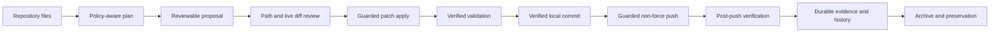

# Autonomous Forge

Autonomous Forge is an open-source, local-first Python CLI built through an AI software-stewardship experiment. It is a **pre-alpha, human-in-the-loop maintenance safety framework**, not an unattended AI engineer.

The repository does not call an AI model itself. External agents supply autonomy; Forge supplies repository planning, policy checks, guarded side-effect gates, Git verification, and durable maintenance evidence.

## What it does

```mermaid
flowchart LR
    A[Repository files] --> B[Policy-aware plan]
    B --> C[Reviewable proposal]
    C --> D[Path and live diff review]
    D --> E[Guarded patch apply]
    E --> F[Verified validation]
    F --> G[Verified local commit]
    G --> H[Guarded non-force push]
    H --> I[Post-push verification]
    I --> J[Durable evidence and history]
    J --> K[Archive and preservation]
```

Forge keeps review stages separate from stages that can change files, run commands, commit, push, or persist evidence. Side effects require explicit confirmation at the relevant boundary.

## Main capabilities

### Policy-aware planning

`forge plan` reads the repository roadmap, policy, state, and documented project files; selects the highest-priority eligible task; identifies allowed/prohibited areas; and emits a concrete reviewable plan with expected files, validation steps, risks, and reasons. It is local-first and read-only.

### Review and guarded change

Forge can build change proposals and validation plans, review planned paths against policy, inspect supplied or live tracked Git diffs, reject path escapes and malformed evidence, apply a confirmed replacement, verify the resulting target-scoped live diff, roll back on verification failure, and execute exact retained validation commands with bounded `shell=False` subprocesses. Guarded patch replacement is prepared in a same-directory temporary file, fsynced, atomically switched into place, and followed by a parent-directory fsync; immediately before apply and rollback Forge rechecks the target text against the exact bytes that authorized that write so stale concurrent edits are refused rather than overwritten.

### Verified maintenance chain

The connected workflow now includes:

- `forge verified-change-apply-run`: guarded replacement write → live-diff verification → retained validations → optional verified local commit, with separate apply/validation/commit confirmations.
- `forge verified-push-run`: verified commit → trust/status/protection readiness → separately confirmed fast-forward push → post-push verification. Workflow status can be supplied as reviewed JSON or explicitly collected live for the exact verified created commit through the existing bounded, completeness-checked GitHub workflow-status collector. When live status is used, the normalized collector proof is now also exposed as top-level `live_status_evidence` on the verified push run so downstream reviewers do not have to reopen nested push-readiness JSON.
- `forge verified-maintenance-run`: post-push-verified evidence → canonical durable bundle → `.ai/run-history/` link, with separate persistence confirmations. Durable verified provenance retains the normalized live workflow-status proof and its deterministic SHA-256 when live status was used; maintenance history links now retain a compact hash-bound summary of that same proof.
- `forge verified-full-maintenance-run`: composes the full guarded preview/apply → validation → commit → push → post-push → durable-history lifecycle in one invocation while preserving independent authority gates for every side effect. It can derive patch readiness and change readiness in memory from existing reviewed evidence, generate the patch preview fresh from the current target/replacement, or consume the legacy persisted evidence path.

After all retained validation commands pass, verified change orchestration hashes the exact target bytes into commit-readiness evidence. Verified commit creation re-hashes that target immediately before staging and refuses the commit if the file changed after validation. Forge performs verified staging through a private temporary Git index initialized from the reviewed `HEAD`, so unrelated caller staging cannot enter the commit. Reviewed paths already staged in the shared index are refused; after a verified commit Forge confirms that the shared repository `HEAD` is still the exact verified commit and that reviewed shared-index entries did not change concurrently, synchronizes only those paths against the immutable `created_commit` SHA, then rechecks `HEAD` after synchronization so branch movement around that transaction is surfaced fail-closed. Within the private index, Forge hashes the exact staged bytes for the target, requires the complete staged path set to equal the reviewed paths, rechecks the reviewed parent `HEAD`, and repeats both index checks immediately before `git commit`. After Git creates the commit, Forge verifies the target bytes, exact changed paths, and created commit parent before the commit can be marked verified.

The underlying planning, diff review, patch, validation, commit, push, replay, archive, package, and preservation commands remain independently usable and reviewable.

## Evidence and preservation

Forge supports SHA-linked maintenance bundles, run-history records, replay/reviewer handoffs, archive manifests, copied archive roots, `.tar`/`.tar.gz`/`.zip` packaging, package verification, preservation-completeness checks, and immutable preservation receipts. Durable verified-full-maintenance push evidence, maintenance bundle outputs, maintenance history links, preservation receipts, confirmed archive manifests, primary run-history records, copied archive entries, and archive packages refuse silent overwrite through their normal writers; a later run must choose a new output path rather than clobber preserved evidence. Verified-full-maintenance push-evidence publication, maintenance bundle publication, maintenance history-link publication, archive-manifest publication, primary run-history publication, archive-copy publication, and archive-package publication use same-directory temporary files plus no-clobber publication and parent-directory `fsync`, closing races between output preflight and the final durable write. Archive-copy publication additionally rechecks the copied byte count and SHA-256 against the verified preview before exposing each final destination, while archive packages are fully constructed and fsynced before publication so package-construction failures do not leave partial final artifacts.

For externally supplied validation observations, new workflows can use `forge validation-result-attachment-write` to create a separate immutable JSON sidecar under `.ai/run-history/validation-attachments/`. The sidecar leaves the original run-history record byte-for-byte unchanged, binds itself to that exact source with SHA-256 and byte count, refuses overwrite/path escape/stale source bytes, and can be re-verified against later source drift. `forge run-history-read` performs a bounded non-recursive discovery pass and surfaces verified sidecars that explicitly bind to the selected source record while preserving legacy `run-history/v1` fields unchanged. Attachment discovery now enumerates incrementally, fails closed above 100 direct JSON candidates or 1,000 total direct entries, and reads each admitted candidate through a 1 MiB ceiling before parsing and verification selection. `forge maintenance-replay-summary --validation-record ...` carries verified sidecars into replay output as fingerprinted **external advisory provenance**. `forge maintenance-evidence-bundle --validation-record ...` persists that same verified provenance class in the durable bundle itself, and confirmed maintenance history links retain a compact SHA-256-bound summary of that block so consumers can discover advisory provenance without opening the full bundle.

## Testing and CI

The repository workflow targets Python **3.10, 3.11, and 3.12**. It installs the package, compiles source, smoke-tests the installed CLI, validates the roadmap, and runs pytest.

AUTO-141/AUTO-142 were dedicated baseline-recovery milestones. Subsequent work connected live diff review, guarded patching, validation, commit verification, non-force push, post-push verification, and durable evidence into one maintenance workflow.

There is still no dedicated lint, type-check, coverage, or release workflow, and there are no tagged releases.

## Safety boundary

Positive controls include repository path/symlink containment, policy-aware path checks, simple secret-marker checks, explicit confirmations for every side effect, bounded `shell=False` command execution, atomic/fsynced guarded patch replacement with stale-target refusal on both apply and rollback after failed post-write diff verification, SHA-256 evidence binding, complete retained-validation coverage before commit readiness, exact target-byte SHA-256 binding after successful validation with mandatory pre-stage working-tree, private-index staged-byte/path, final pre-commit index, reviewed-parent HEAD, and post-commit target/parent/path checks, private temporary Git-index isolation that prevents unrelated shared staging from entering verified commits, fail-closed refusal when reviewed paths are already staged by the caller, shared-HEAD binding plus shared-index entry drift detection before reviewed-path synchronization, immutable created-commit targeting during shared-index synchronization, post-sync HEAD drift detection, exact changed-path commit verification, explicit bounded workflow-status collection for the exact verified commit, fast-forward-only non-force push behavior, no tag pushes or remote/protection mutation, post-push reachability verification, durable evidence hashing, refusal to overwrite existing durable outputs, atomic/no-clobber persistence, immutable hash-bound validation sidecars, and bounded fail-closed attachment discovery and verification selection.

Important limitations remain:

- live diff review covers tracked changes, not untracked files;
- passing configured validation commands does not prove those commands are sufficient for correctness;
- commit-trust and branch-protection inputs remain caller-supplied evidence;
- hashes detect byte drift but do not prove signer identity;
- secret detection is not a full secret scanner;
- there is no shared lock for external scheduled agents or multi-process validation-result writers;
- immutable validation sidecars remain externally supplied observations and are never promoted to executor-produced validation evidence;
- no-clobber durable publication relies on ordinary same-filesystem hard-link support;
- archive-copy publication is per-file rather than a cross-file transaction, so a later-entry failure can leave earlier verified entries durably published for inspection;
- atomic patch replacement preserves the target permission mode but intentionally does not promise preservation of every filesystem metadata field;
- verified commit creation reduces but does not eliminate every possible external Git concurrency race;
- Forge is not ready for unattended use on important repositories.

## Project memory

The `.ai` directory is the repository's engineering memory:

- `.ai/AUTONOMOUS_PLAN.md`
- `.ai/AUTONOMOUS_STATE.md`
- `.ai/AUTONOMOUS_CHANGELOG.md`
- `.ai/DECISIONS.md`

Historical branches and pull requests are inspect-before-integrate evidence only. Current stewardship works directly on `main` and does not create replacement PRs.

## Current Autonomous Status

Latest stewardship run: **AUTO-222 — bound run-history validation attachment discovery**.

- **Changed:** `forge run-history-read` now enumerates immutable validation-sidecar directory entries incrementally with `os.scandir()`, fails closed at the 101st direct JSON candidate or 1,001st total direct entry, reads each admitted candidate through a 1 MiB ceiling before parsing/verification selection, and sorts only the admitted candidate set.
- **Why:** the previous reader materialized and sorted the complete `glob("*.json")` result before enforcing its 100-file limit, and candidate reads were unbounded; a large evidence directory could therefore consume unbounded memory/work before the intended safety gate took effect.
- **Validation:** deterministic AUTO-222 coverage was added for both enumeration sentinels and the 1 MiB candidate ceiling. Fresh Python 3.10/3.11/3.12 Actions validation is required before this run can be marked DONE.
- **Safety:** run-history reading remains local and read-only. The change grants no validation, persistence, Git, workflow, push, network, or approval authority; immutable sidecars remain external observations and still pass through the existing source-binding verifier.
- **Branch/PR disposition:** work stayed directly on `main`; all seven non-main branches remain historical/diverged and recent PRs are merged, closed, obsolete, or unrelated. No branch or PR was created or merged.
- **Visual updates:** none; this tightens resource bounds inside the existing evidence stage without changing lifecycle topology.
- **Current limitations:** the 100-JSON, 1,000-direct-entry, and 1 MiB limits are fixed fail-closed local contracts rather than streaming/indexed discovery. Matching sidecars still rely on the existing verifier after bounded admission.
- **Next autonomous objective:** check AUTO-222 CI first; any failure takes priority. If green, continue only with another concrete end-to-end integrity defect or meaningful evidence-handoff reduction.
