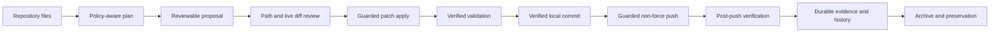

# Autonomous Forge

Autonomous Forge is an open-source, local-first Python CLI built through an AI software-stewardship experiment. It is a **pre-alpha, human-in-the-loop maintenance safety framework**, not an unattended AI engineer.

The repository does not call an AI model itself. External agents supply autonomy; Forge supplies repository planning, policy checks, guarded side-effect gates, Git verification, and durable maintenance evidence.

## What it does

```mermaid
flowchart LR
    A[Repository files] --> B[Policy-aware plan]
    B --> C[Reviewable proposal]
    C --> D[Path and live diff review]
    D --> E[Guarded patch apply]
    E --> F[Verified validation]
    F --> G[Verified local commit]
    G --> H[Guarded non-force push]
    H --> I[Post-push verification]
    I --> J[Durable evidence and history]
    J --> K[Archive and preservation]
```

Forge keeps review stages separate from stages that can change files, run commands, commit, push, or persist evidence. Side effects require explicit confirmation at the relevant boundary.

## Main capabilities

### Policy-aware planning

`forge plan` reads the repository roadmap, policy, state, and documented project files; selects the highest-priority eligible task; identifies allowed/prohibited areas; and emits a concrete reviewable plan with expected files, validation steps, risks, and reasons. It is local-first and read-only.

### Review and guarded change

Forge can build change proposals and validation plans, review planned paths against policy, inspect supplied or live tracked Git diffs, reject path escapes and malformed evidence, apply confirmed replacements with stale-target protection, verify resulting diffs, and execute retained validation commands with bounded `shell=False` subprocesses.

### Verified maintenance chain

The connected workflow includes guarded replacement → live-diff verification → retained validation → optional verified local commit → trust/status/protection readiness → separately confirmed fast-forward push → post-push verification → durable maintenance evidence and history. The higher-level `forge verified-full-maintenance-run` composes that lifecycle while keeping independent authority gates for side effects.

Verified commit creation isolates staging through a private temporary Git index, binds reviewed target bytes and changed paths to the expected parent, refuses unrelated shared staging, and rechecks reviewed state before and after commit synchronization. Push execution is non-force and explicitly confirmed, and post-push verification remains separate.

## Evidence and preservation

Forge supports SHA-linked maintenance bundles, run-history records, replay/reviewer handoffs, archive manifests, copied archive roots, `.tar`/`.tar.gz`/`.zip` packages, package verification, preservation-completeness checks, and immutable preservation receipts.

Durable writers use repository confinement, explicit confirmation, no-clobber publication, file/directory `fsync`, SHA-256 binding, and fail-closed verification. Archive hashing and package member verification stream in bounded chunks instead of materializing complete evidence files in memory.

Recent preservation hardening includes:

- archive manifests bind selected evidence, including run-history-link bytes where authoritative digests exist;
- archive copy/package verification hashes content incrementally and rejects byte-count or digest drift;
- archive manifests and archive packages are immediately reverified after publication;
- failed or Python-interrupted verification rolls back only bytes still owned by the current invocation;
- archive-package and archive-copy publication perform ownership-checked rollback when parent-directory durability sync fails after publication;
- immutable validation-result sidecar publication applies the same ownership-checked rollback rule when its parent-directory durability sync fails;
- the historical in-place validation-result writer now restores the exact original run-history bytes when its post-replacement directory sync fails, but only while the current record still matches this invocation's replacement digest;
- preservation-receipt verification and discovery use bounded input/candidate limits and remain informational rather than readiness gates;
- externally supplied validation sidecars remain advisory provenance and are never promoted into executor-produced validation authority.

AUTO-241 closes the remaining durability ambiguity in the historical in-place validation-result writer. If `os.replace()` succeeds but the parent-directory `fsync` fails, Forge SHA-256 checks the current replacement, recreates the exact pre-write record bytes in a flushed same-directory rollback temporary file, checks ownership again, restores those original bytes, and fsyncs the directory. If the record changed after replacement, Forge preserves the changed bytes for inspection rather than overwriting another writer's data.

See `docs/VALIDATION_RESULT_WRITES.md` for the in-place validation-result write contract and recovery limits.

## Testing and CI

The repository workflow targets Python **3.10, 3.11, and 3.12**. It installs the package, compiles source, smoke-tests the installed CLI, validates the roadmap, and runs pytest.

There is still no dedicated lint, type-check, coverage, or release workflow, and there are no tagged releases.

## Safety boundary

Important controls include repository path/symlink containment, policy-aware path checks, explicit confirmations for side effects, bounded local subprocesses, stale-target refusal, SHA-256 evidence binding, private-index commit isolation, fast-forward-only non-force push behavior, post-push verification, no-clobber durable publication, bounded-memory archive hashing, and ownership-checked rollback of newly published or replaced evidence.

Important limitations remain:

- live diff review covers tracked changes, not untracked files;
- passing configured validation commands does not prove those commands are sufficient for correctness;
- hashes prove byte continuity, not signer identity;
- secret detection is not a full secret scanner;
- no filesystem-level lock can permanently prevent later evidence mutation;
- Python cleanup cannot run after abrupt termination such as `SIGKILL`, host failure, interpreter crash, or power loss;
- a filesystem that fails both publication and rollback directory sync leaves durability uncertain and requires inspection;
- in-place validation rollback still has a small cross-process race between its final ownership check and rollback rename because Forge does not hold a shared filesystem lock;
- archive-copy publication is per-file rather than a cross-file transaction;
- no-clobber durable publication relies on ordinary same-filesystem hard-link support;
- Forge is not ready for unattended use on important repositories.

## Project memory

The `.ai` directory is the repository's engineering memory:

- `.ai/AUTONOMOUS_PLAN.md`
- `.ai/AUTONOMOUS_STATE.md`
- `.ai/AUTONOMOUS_CHANGELOG.md`
- `.ai/DECISIONS.md`

Historical branches and pull requests are inspect-before-integrate evidence only. Current stewardship works directly on `main` and does not create replacement PRs.

## Current Autonomous Status

Latest stewardship run: **AUTO-241 — restore in-place validation records when replacement durability sync fails**.

- **Changed:** the historical `forge validation-result-write` path no longer leaves a newly replaced authoritative run-history record behind when `os.replace()` succeeds but the following parent-directory `fsync` fails. Forge retains the exact pre-write bytes, SHA-256 checks the replacement, writes a flushed rollback sibling, checks ownership again, restores the original bytes, and fsyncs the directory.
- **Why:** AUTO-240 hardened immutable sidecars, but the older in-place writer still had a concrete failure mode where a command returned an error after already replacing the authoritative record. AUTO-241 resolves that write-integrity defect without adding a new command or weakening single-assignment validation semantics.
- **Validation:** deterministic tests cover successful restoration after a synthetic first directory-sync failure, the public confirmed write path, and the racing-mutation case where changed bytes must be preserved. The final Python 3.10/3.11/3.12 Actions matrix is checked for installation, source compilation, installed CLI smoke tests, roadmap validation, and full pytest before this cycle is reported complete.
- **Safety:** explicit confirmation, `.ai/run-history` path confinement, the 1 MiB source ceiling, stale-source checks, atomic same-directory replacement, and single-assignment evidence rules remain intact. Rollback never intentionally overwrites a target whose current digest no longer matches this invocation's replacement.
- **Branch/PR disposition:** all eight visible branches and current PR/issue history were inspected. The seven non-main branches remain historical/diverged; there are no open PRs requiring integration. Open issues #1, #6, and #9 remain broader product/discussion requests rather than blockers for this repair.
- **Visual updates:** none; workflow topology did not change, only durability recovery at an existing in-place evidence write boundary became safer.
- **Current limitations:** rollback requires Python cleanup to execute; a second directory-sync failure can leave durability uncertain; there is no shared cross-process filesystem lock; and a target mutation in the narrow interval after the last ownership check still requires external coordination to eliminate completely.
- **Next autonomous objective:** inspect the remaining overwrite-capable durable writers for the same replace-then-directory-sync ambiguity, prioritizing any path that can mutate authoritative evidence rather than immutable sidecars; any fresh CI failure takes priority.
