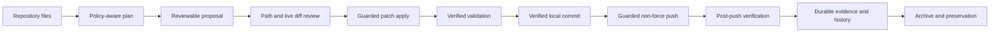

# Autonomous Forge

Autonomous Forge is an open-source, local-first Python CLI built through an AI software-stewardship experiment. It is a **pre-alpha, human-in-the-loop maintenance safety framework**, not an unattended AI engineer.

The repository does not call an AI model itself. External agents supply autonomy; Forge supplies repository planning, policy checks, guarded side-effect gates, Git verification, and durable maintenance evidence.

## What it does

```mermaid
flowchart LR
    A[Repository files] --> B[Policy-aware plan]
    B --> C[Reviewable proposal]
    C --> D[Path and live diff review]
    D --> E[Guarded patch apply]
    E --> F[Verified validation]
    F --> G[Verified local commit]
    G --> H[Guarded non-force push]
    H --> I[Post-push verification]
    I --> J[Durable evidence and history]
    J --> K[Archive and preservation]
```

Forge keeps review stages separate from stages that can change files, run commands, commit, push, or persist evidence. Side effects require explicit confirmation at the relevant boundary.

## Main capabilities

### Policy-aware planning

`forge plan` reads the repository roadmap, policy, state, and documented project files; selects the highest-priority eligible task; identifies allowed/prohibited areas; and emits a concrete reviewable plan with expected files, validation steps, risks, and reasons. It is local-first and read-only.

### Review and guarded change

Forge can build change proposals and validation plans, review planned paths against policy, inspect supplied or live tracked Git diffs, reject path escapes and malformed evidence, apply a confirmed replacement, verify the resulting target-scoped live diff, roll back on verification failure, and execute exact retained validation commands with bounded `shell=False` subprocesses. Guarded patch replacement is prepared in a same-directory temporary file, fsynced, atomically switched into place, and followed by a parent-directory fsync; immediately before apply and rollback Forge rechecks the target text against the exact bytes that authorized that write so stale concurrent edits are refused rather than overwritten.

### Verified maintenance chain

The connected workflow now includes:

- `forge verified-change-apply-run`: guarded replacement write → live-diff verification → retained validations → optional verified local commit, with separate apply/validation/commit confirmations.
- `forge verified-push-run`: verified commit → trust/status/protection readiness → separately confirmed fast-forward push → post-push verification. Workflow status can be supplied as reviewed JSON or explicitly collected live for the exact verified created commit through the existing bounded, completeness-checked GitHub workflow-status collector. When live status is used, the normalized collector proof is now also exposed as top-level `live_status_evidence` on the verified push run so downstream reviewers do not have to reopen nested push-readiness JSON.
- `forge verified-maintenance-run`: post-push-verified evidence → canonical durable bundle → `.ai/run-history/` link, with separate persistence confirmations. Durable verified provenance retains the normalized live workflow-status proof and its deterministic SHA-256 when live status was used; maintenance history links now retain a compact hash-bound summary of that same proof.
- `forge verified-full-maintenance-run`: composes the full guarded preview/apply → validation → commit → push → post-push → durable-history lifecycle in one invocation while preserving independent authority gates for every side effect. It can derive patch readiness and change readiness in memory from existing reviewed evidence, generate the patch preview fresh from the current target/replacement, or consume the legacy persisted evidence path.

After all retained validation commands pass, verified change orchestration hashes the exact target bytes into commit-readiness evidence. Verified commit creation re-hashes that target immediately before staging and refuses the commit if the file changed after validation. Forge performs verified staging through a private temporary Git index initialized from the reviewed `HEAD`, so unrelated caller staging cannot enter the commit. Reviewed paths already staged in the shared index are refused; after a verified commit Forge confirms that the shared repository `HEAD` is still the exact verified commit and that reviewed shared-index entries did not change concurrently, synchronizes only those paths against the immutable `created_commit` SHA, then rechecks `HEAD` after synchronization so branch movement around that transaction is surfaced fail-closed. Within the private index, Forge hashes the exact staged bytes for the target, requires the complete staged path set to equal the reviewed paths, rechecks the reviewed parent `HEAD`, and repeats both index checks immediately before `git commit`. After Git creates the commit, Forge verifies the target bytes, exact changed paths, and created commit parent before the commit can be marked verified.

The underlying planning, diff review, patch, validation, commit, push, replay, archive, package, and preservation commands remain independently usable and reviewable.

## Evidence and preservation

Forge supports SHA-linked maintenance bundles, run-history records, replay/reviewer handoffs, archive manifests, copied archive roots, `.tar`/`.tar.gz`/`.zip` packaging, package verification, preservation-completeness checks, and immutable preservation receipts. Durable verified-full-maintenance push evidence, maintenance bundle outputs, maintenance history links, preservation receipts, confirmed archive manifests, primary run-history records, copied archive entries, and archive packages refuse silent overwrite through their normal writers; a later run must choose a new output path rather than clobber preserved evidence. Verified-full-maintenance push-evidence publication, maintenance bundle publication, maintenance history-link publication, archive-manifest publication, primary run-history publication, archive-copy publication, and archive-package publication use same-directory temporary files plus no-clobber publication and parent-directory `fsync`, closing races between output preflight and the final durable write. Archive-copy publication additionally rechecks the copied byte count and SHA-256 against the verified preview before exposing each final destination; AUTO-226 performs that SHA-256 recheck incrementally in 64 KiB chunks so large preserved evidence is never materialized wholesale in memory during the confirmed copy path. AUTO-227 applies the same bounded-memory SHA-256 behavior when `forge maintenance-archive-copy-verify` later reopens the copied archive root. AUTO-228 extends that bounded-memory contract through `forge maintenance-archive-package-verify`: both the package file and each tar/zip member are byte-counted and SHA-256 hashed incrementally in 64 KiB chunks instead of being materialized wholesale in memory. AUTO-229 applies the same bounded-memory hashing contract to archive-manifest preview and written-manifest verification: selected maintenance bundles and source reports are SHA-256 hashed incrementally in 64 KiB chunks, and the preview reuses the already-computed bundle digest instead of hashing that bundle twice. AUTO-230 extends the same bounded-memory contract into confirmed archive-package creation itself: tar/zip source entries and the finished package digest are streamed in 64 KiB chunks, expected byte counts are rechecked for every entry while writing, and entries with an expected preview SHA-256 must retain that digest before no-clobber publication. AUTO-231 closes the remaining digest gap for new preservation sets by binding the selected run-history link's exact bytes to a SHA-256 in the archive manifest; later manifest, copied-root, and package stages can therefore reject same-size link drift without promoting that link into validation authority. AUTO-232 closes a separate direct-verification resource gap: `verify_maintenance_preservation_receipt(...)` now defaults to the same fixed 1 MiB receipt-input ceiling used by bounded discovery, failing closed before decoding or parsing oversized receipts. AUTO-233 closes a preview-to-publication receipt integrity gap: confirmed preservation-receipt writes recheck the exact completeness path, byte count, and SHA-256 immediately before and after no-clobber publication; drift detected after publication removes the destination receipt and fsyncs the receipt directory before failing closed. AUTO-234 adds the corresponding immediate continuity guard to the installed confirmed archive-manifest write path: after no-clobber publication, Forge re-opens the new manifest through the existing verifier and returns success only while every listed evidence file still matches; failed verification removes only the exact manifest bytes this invocation published and durably fsyncs that rollback. Archive packages are fully constructed and fsynced before publication so package-construction failures or digest-bound source drift do not leave partial final artifacts.

For externally supplied validation observations, new workflows can use `forge validation-result-attachment-write` to create a separate immutable JSON sidecar under `.ai/run-history/validation-attachments/`. The sidecar leaves the original run-history record byte-for-byte unchanged, binds itself to that exact source with SHA-256 and byte count, refuses overwrite/path escape/stale source bytes, and can be re-verified against later source drift. Direct immutable-sidecar source snapshots and direct attachment verification are capped at 1 MiB and fail closed before parsing, fingerprinting, or publication when exceeded. `forge run-history-read` reads the authoritative `run-history/v1` record through a fixed 1 MiB ceiling, then performs a bounded non-recursive discovery pass and surfaces verified sidecars that explicitly bind to the selected source record while preserving legacy fields unchanged. Attachment discovery enumerates incrementally, fails closed above 100 direct JSON candidates or 1,000 total direct entries, and reads each admitted candidate through a 1 MiB ceiling before parsing and verification selection. `forge maintenance-replay-summary --validation-record ...` carries verified sidecars into replay output as fingerprinted **external advisory provenance**. `forge maintenance-evidence-bundle --validation-record ...` persists that same verified provenance class in the durable bundle itself, and confirmed maintenance history links retain a compact SHA-256-bound summary of that block so consumers can discover advisory provenance without opening the full bundle. `forge maintenance-history-link-review --verify-linked-bundle` validates a present compact external-validation summary against the actual linked bundle provenance and independently verifies a present compact live workflow-status summary against the linked bundle's authoritative `verified_provenance.live_status_evidence`, including deterministic SHA-256, exact commit, source, bounded workflow-run limit, collection completeness, and per-run commit binding. `forge maintenance-review-handoff` surfaces that already-verified live-status result as reviewer-facing provenance, and `forge maintenance-review-compare` carries the same normalized proof into handoff rows and preservation candidates while explicitly excluding it from preservation scoring. `forge maintenance-archive-manifest` carries that same live-status proof into archive-manifest preview, confirmed write, and written-manifest verification as informational provenance that cannot affect manifest readiness or archive-integrity scoring. `forge maintenance-archive-copy-verify`, archive package preview, and `forge maintenance-archive-package-verify` carry the same live-status proof through copied-root and packaged-evidence review while keeping it outside copy/package readiness and integrity results. `forge maintenance-preservation-completeness` carries that same normalized proof through the final preservation boundary, reports whether the normalized proof matches across manifest/copy/package review, and keeps it explicitly outside preservation completeness and integrity gates. `forge maintenance-preservation-receipt` derives the same live-status proof from the already-complete, SHA-256-bound preservation artifact into receipt preview/write/verification and verified discovery rows, so reviewers can inspect retained workflow provenance without reopening the completeness JSON; receipt status remains informational and cannot change preservation completeness or integrity. The same reviewer and preservation surfaces continue to carry external-validation provenance without making it a readiness gate or preservation-ranking signal. `forge maintenance-archive-manifest` also promotes the selected candidate's external advisory summary to a first-class archive-manifest field. `forge maintenance-archive-copy-verify`, package preview, and `forge maintenance-archive-package-verify` carry the same external-validation summary through copied-root and packaged-evidence review. `forge maintenance-preservation-completeness` exposes that external-validation summary at the final preservation boundary and reports whether the normalized provenance remained consistent across the written manifest, copied-root verification, and package verification. Retained validation context must agree with the bundle, and external observations are always marked as not equivalent to executor-produced validation proof and cannot affect bundle or preservation completeness. The historical in-place `forge validation-result-write` remains available for backward compatibility; both the historical `not run` and newer `not_run` placeholder spellings are recognized as empty validation states for the first explicitly confirmed attachment, while actual prior validation evidence remains immutable. `forge maintenance-preservation-receipt` can bind one already-complete preservation artifact into a compact immutable receipt under `.ai/preservation-receipts/`; receipt verification recomputes the exact completeness byte count and SHA-256 instead of re-running lower-level archive gates. Receipt preview/write, verification, and discovery read that authoritative preservation-completeness artifact through a fixed 1 MiB ceiling. Direct receipt verification also defaults to a 1 MiB receipt-input ceiling; oversized direct inputs fail closed before UTF-8 decoding or JSON parsing. Confirmed receipt publication additionally rechecks the exact bound completeness bytes immediately before and after immutable publication; if drift is observed after the destination link exists, the stale destination is removed and the directory is fsynced before the write fails. Its `--discover` mode performs a bounded local review of receipts bound to a chosen complete artifact and remains informational only: receipt presence or absence never changes preservation completeness. Discovery enforces a hard ceiling of 100 direct JSON candidates even for direct Python callers, stops enumeration after at most 1,000 direct directory entries, and reads each admitted candidate through a 1 MiB ceiling. Invalid receipts that explicitly bind to the selected completeness artifact still require attention, while malformed, oversized, unsupported, or unbound directory entries are surfaced separately as unattributed invalid evidence so unrelated artifacts are not falsely downgraded. `forge maintenance-review-compare --completeness ...` reuses that same discovery contract to show receipt state next to matching handoffs and preservation candidates without changing comparison readiness or candidate ranking. Equivalent completeness paths are canonicalized and deduplicated inside the comparison builder itself, so CLI and direct Python callers cannot inflate receipt counts with repeated relative, dotted-relative, absolute, or symlink-resolved references to the same artifact.

## Testing and CI

The repository workflow targets Python **3.10, 3.11, and 3.12**. It installs the package, compiles source, smoke-tests the installed CLI, validates the roadmap, and runs pytest.

AUTO-141/AUTO-142 were dedicated baseline-recovery milestones. Subsequent work connected live diff review, guarded patching, validation, commit verification, non-force push, post-push verification, and durable evidence into one maintenance workflow.

There is still no dedicated lint, type-check, coverage, or release workflow, and there are no tagged releases.

## Safety boundary

Positive controls include repository path/symlink containment, policy-aware path checks, simple secret-marker checks, explicit confirmations for every side effect, bounded `shell=False` command execution, atomic/fsynced guarded patch replacement with stale-target refusal on both apply and rollback after failed post-write diff verification, SHA-256 evidence binding, complete retained-validation coverage before commit readiness, exact target-byte SHA-256 binding after successful validation with mandatory pre-stage working-tree, private-index staged-byte/path, final pre-commit index, reviewed-parent HEAD, and post-commit target/parent/path checks, private temporary Git-index isolation that prevents unrelated shared staging from entering verified commits, fail-closed refusal when reviewed paths are already staged by the caller, shared-HEAD binding plus shared-index entry drift detection before reviewed-path synchronization, immutable created-commit targeting during shared-index synchronization, post-sync HEAD drift detection, exact changed-path commit verification, explicit bounded workflow-status collection for the exact verified commit when `--live-status` is selected with collector-level per-workflow-run head-SHA binding, a 15-second timeout on every live `git`/`gh` subprocess, one extra sentinel result that fails closed when the configured 20-run review window would be truncated, structured live-collection evidence that must preserve both completeness and commit-binding guarantees when the payload becomes a status review and remains explicitly validated/preserved through push readiness, the verified push-run artifact, durable verified maintenance provenance, the compact maintenance history-link live-status summary, linked-bundle verification that independently revalidates that compact summary against authoritative bundle provenance before linked replay is accepted, reviewer-facing handoff/comparison propagation, archive-manifest propagation, copied-root/package propagation, final preservation-completeness propagation, and immutable preservation-receipt propagation that keep the same live-status proof informational and outside readiness/integrity scoring, fast-forward-only non-force push behavior, no tag pushes or remote/protection mutation, post-push reachability verification, durable evidence hashing, refusal to overwrite existing durable bundle/history/package outputs, durable no-clobber verified-push/maintenance-bundle/history-link/run-history/archive-manifest/archive-copy/archive-package publication with file and parent-directory fsync, archive-manifest evidence SHA-256 hashing with incremental bounded-memory reads including selected history-link content binding for new manifests, immediate installed-CLI archive-manifest post-publication verification with exact-output rollback ownership checks and durable directory fsync on detected drift, archive-copy source-byte/SHA continuity checks before final publication using incremental bounded-memory hashing, bounded-memory copied-root and archive-package/member SHA-256 verification, bounded-memory archive-package source streaming with expected byte-count checks and conditional expected-digest binding before publication, refusal to replace previously recorded validation evidence, immutable hash-bound validation sidecars for new external observations, stale-source refusal, atomic/no-clobber persistence, parent-directory fsync after durable validation evidence publication, bounded 1 MiB authoritative run-history reads and immutable-validation source/attachment snapshots, bounded fail-closed attachment discovery in the primary run-history reader, advisory-only replay carriage for externally supplied validation observations, advisory-only durable-bundle carriage for those same observations, compact hash-bound advisory-provenance summaries in maintenance history links, linked-bundle verification that fails closed when a present compact summary disagrees with the full advisory provenance block, reviewer-facing handoff/comparison propagation that preserves advisory semantics without changing readiness or ranking, archive-manifest propagation that preserves those same fixed advisory semantics without changing manifest readiness or archive-integrity scoring, copied-root/package propagation that keeps advisory provenance visible without changing copy/package readiness or integrity results, final preservation-completeness reporting that verifies cross-layer advisory-provenance continuity without turning external observations into a preservation gate, explicitly confirmed immutable preservation receipts that bind to exact completeness artifact bytes without duplicating archive verification and rebuild retained live-status provenance during verification, bounded direct receipt verification that defaults to the same fixed 1 MiB candidate ceiling used by discovery, confirmed receipt publication that revalidates exact completeness path/bytes/SHA immediately before and after no-clobber publication and removes a just-published destination if drift is observed, bounded informational receipt discovery that independently requires a complete source artifact, reads that authoritative completeness artifact through a fixed 1 MiB ceiling, caps direct JSON candidates at 100 and total direct directory entries at 1,000, reads each candidate through a 1 MiB ceiling, keeps matching invalid evidence fail-closed, and reports unattributed malformed/oversized/unsupported/unbound directory entries without contaminating unrelated artifact reviews, higher-level comparison receipt review that reuses the same receipt verifier while remaining outside readiness and ranking scores, and core-level canonical-path deduplication of comparison completeness inputs so the same evidence file cannot be counted more than once regardless of whether the caller is the CLI or Python API.

Important limitations remain:

- live diff review covers tracked changes, not untracked files;
- passing configured validation commands does not prove those commands are sufficient for correctness;
- commit-trust and branch-protection inputs remain caller-supplied evidence; commit status can now be explicitly collected live for the exact verified commit, but Forge still does not independently acquire signer trust or branch-protection policy;
- live workflow-status collection depends on a functioning authenticated GitHub CLI, requires every admitted run to report the exact requested commit as its head SHA, applies a 15-second timeout to each live `git`/`gh` subprocess, refuses a result set that exceeds the configured 20-run review window rather than treating truncated workflow evidence as complete, and requires those completeness/commit-binding guarantees to survive the payload→review→push-readiness→verified-push-run→durable-maintenance→maintenance-history-link→linked-bundle-review→review-handoff→review-comparison→archive-manifest→archive-copy/package-review→preservation-completeness→preservation-receipt conversion; it still does not rerun workflows or prove that the configured checks are sufficient;
- post-push verification relies on local remote-tracking refs unless fetch is explicitly requested;
- hashes detect byte drift but do not prove signer identity;
- secret detection is not a full secret scanner;
- there is no shared lock for external scheduled agents or multi-process validation-result writers;
- immutable validation sidecars are visible through `run-history-read`, replay, durable bundle construction, maintenance history-link summaries, linked-bundle history review, reviewer handoff/comparison surfaces, archive-manifest preview/write/verification surfaces, copied-root verification, package preview/verification surfaces, and final preservation-completeness summaries, but remain externally supplied observations and are never promoted to executor-produced validation evidence;
- legacy history links/manifests without the compact external-validation summary remain compatible, and legacy/non-live maintenance bundles likewise do not receive synthetic live-status summaries;
- preservation-receipt discovery and reviewer comparison receipt annotations are intentionally informational and do not make a receipt mandatory for an otherwise complete preservation artifact or change candidate ranking; malformed/oversized/unsupported/unbound receipt files remain visible as unattributed directory noise rather than evidence against every artifact, while the authoritative completeness input and each receipt candidate are bounded to 1 MiB, direct receipt verification defaults to that same 1 MiB ceiling, admitted JSON receipts are capped at 100, and enumeration is capped at 1,000 direct entries by fixed local safety contracts rather than streaming validation;
- callers that deliberately supply the legacy direct-verifier `max_receipt_bytes` override can choose a different receipt limit for API compatibility; the safe default is 1 MiB;
- preservation receipts expose retained live-status provenance only by deriving it from the exact bound completeness artifact; they do not independently query GitHub or make workflow status a preservation gate;
- successful receipt publication proves exact source continuity immediately around the write boundary, not an indefinite lock on the source; if another process changes the completeness artifact later, ordinary receipt verification detects that later drift;
- no-clobber durable publication relies on ordinary same-filesystem hard-link support;
- archive-copy publication is per-file rather than a cross-file transaction, so a later-entry failure can leave earlier verified entries durably published for inspection; archive-manifest hashing, archive-copy publication, copied-root verification, archive-package creation, and archive-package verification hash/stream incrementally, so memory is bounded while I/O/decompression time remains proportional to evidence size;
- legacy written archive manifests that predate AUTO-231 have no expected SHA-256 for the run-history-link entry, so that historical entry remains advisory and cannot retroactively prove same-size content continuity;
- the installed confirmed archive-manifest CLI now performs immediate post-publication verification and exact-output rollback on detected drift, but the historical core Python writer remains independently callable for compatibility; direct callers that need the stronger contract should use `write_verified_maintenance_archive_manifest(...)`;
- immediate archive-manifest publication verification is not a permanent filesystem lock; evidence changed after a successful command returns is detected by ordinary written-manifest verification;
- atomic patch replacement preserves the target permission mode but intentionally does not promise preservation of every filesystem metadata field; stale-target checks reduce but do not eliminate the narrow race between the final comparison and `os.replace`; a parent-directory fsync failure after replacement means the target has already changed and must be inspected before retrying;
- verified commit creation stages through a private temporary Git index and synchronizes reviewed shared-index entries against the immutable verified commit SHA, with HEAD checks before and after that synchronization. The branch ref update is still not compare-and-swap and shared-index synchronization remains a separate Git transaction; branch movement is surfaced fail-closed for inspection rather than repaired destructively.
- run-history records larger than 1 MiB are refused rather than streamed; this is an intentional local resource-safety contract.
- Forge is not ready for unattended use on important repositories.

## Project memory

The `.ai` directory is the repository's engineering memory:
- `.ai/AUTONOMOUS_PLAN.md`
- `.ai/AUTONOMOUS_STATE.md`
- `.ai/AUTONOMOUS_CHANGELOG.md`
- `.ai/DECISIONS.md`

Historical branches and pull requests are inspect-before-integrate evidence only. Current stewardship works directly on `main` and does not create replacement PRs.

## Current Autonomous Status

Latest stewardship run: **AUTO-234 — verify archive-manifest publication against current evidence**.

- **Changed:** confirmed `forge maintenance-archive-manifest --output ... --confirm-write` now routes through a publication-verification wrapper. After the existing no-clobber writer returns, Forge immediately re-opens the new manifest through the established written-manifest verifier and returns success only while all listed evidence still satisfies the manifest's byte/SHA integrity gates.
- **Why:** the underlying writer already built a reviewable SHA-bound snapshot and durably published it, but a source report, maintenance bundle, or run-history link could change after snapshot construction and before the write returned. Later verification would detect that drift; AUTO-234 prevents the installed confirmed write from knowingly reporting success in that window.
- **Rollback safety:** failed immediate verification removes only the exact manifest bytes observed immediately after this invocation published them, then fsyncs the parent directory. If another process changed the output itself, Forge refuses destructive rollback and leaves that file for inspection.
- **Validation:** local scratch syntax compilation passed for the new guard, CLI wiring, and focused test module. Product/test head `5e0a0cacdc11f049936798fa0a19558e9392741b` passed GitHub Actions run `33308380858` across Python 3.10, 3.11, and 3.12, including install, source compilation, installed CLI smoke tests, roadmap validation, and pytest. The final README/project-memory head is checked before this cycle is reported complete.
- **Safety:** existing explicit confirmation, repository containment, no-clobber hard-link publication, temporary-file/directory fsync, archive-entry byte/SHA verification, and later read-only verification remain intact. No product-side network, workflow, Git commit/push, remote, force-push, overwrite, or branch-protection authority was added.
- **Branch/PR disposition:** work stayed directly on `main`; all seven non-main branches remain historical/diverged and inspected PRs are merged, closed, obsolete, superseded, or unrelated. No branch or PR was created or merged.
- **Visual updates:** none; archive/preservation topology is unchanged, only the integrity contract at the existing confirmed archive-manifest write boundary changed.
- **Current limitations:** the stronger contract is on the installed CLI and reusable verified-publication wrapper; the historical core Python writer remains callable for compatibility. Immediate verification is also not a permanent filesystem lock, so ordinary written-manifest verification remains responsible for drift after a successful return.
- **Next autonomous objective:** move the same immediate publication-continuity guarantee into the core archive-manifest writer without breaking direct-call compatibility, or inspect the next confirmed preservation writer for an equivalent build-to-publication race. Any fresh CI failure takes priority.