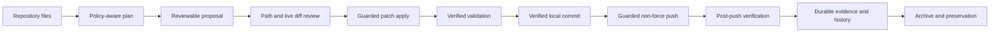

# Autonomous Forge

Autonomous Forge is an open-source, local-first Python CLI built through an AI software-stewardship experiment. It is a **pre-alpha, human-in-the-loop maintenance safety framework**, not an unattended AI engineer.

The repository does not call an AI model itself. External agents supply autonomy; Forge supplies repository planning, policy checks, guarded side-effect gates, Git verification, and durable maintenance evidence.

## What it does

```mermaid
flowchart LR
    A[Repository files] --> B[Policy-aware plan]
    B --> C[Reviewable proposal]
    C --> D[Path and live diff review]
    D --> E[Guarded patch apply]
    E --> F[Verified validation]
    F --> G[Verified local commit]
    G --> H[Guarded non-force push]
    H --> I[Post-push verification]
    I --> J[Durable evidence and history]
    J --> K[Archive and preservation]
```

Forge keeps review stages separate from stages that can change files, run commands, commit, push, or persist evidence. Side effects require explicit confirmation at the relevant boundary.

## Main capabilities

### Policy-aware planning

`forge plan` reads the repository roadmap, policy, state, and documented project files; selects the highest-priority eligible task; identifies allowed/prohibited areas; and emits a concrete reviewable plan with expected files, validation steps, risks, and reasons. It is local-first and read-only.

### Review and guarded change

Forge can build change proposals and validation plans, review planned paths against policy, inspect supplied or live tracked Git diffs, reject path escapes and malformed evidence, apply a confirmed replacement, verify the resulting target-scoped live diff, roll back on verification failure, and execute exact retained validation commands with bounded `shell=False` subprocesses.

### Verified maintenance chain

The connected workflow now includes:

- `forge verified-change-apply-run`: guarded replacement write → live-diff verification → retained validations → optional verified local commit, with separate apply/validation/commit confirmations.
- `forge verified-push-run`: verified commit → trust/status/protection readiness → separately confirmed fast-forward push → post-push verification.
- `forge verified-maintenance-run`: post-push-verified evidence → canonical durable bundle → `.ai/run-history/` link, with separate persistence confirmations.
- `forge verified-full-maintenance-run`: composes the full guarded preview/apply → validation → commit → push → post-push → durable-history lifecycle in one invocation while preserving independent authority gates for every side effect. It can derive patch readiness from matching preflight/audit evidence and generate the patch preview fresh in memory, generate the preview from supplied patch-readiness, or consume a supplied legacy preview file.

The underlying planning, diff review, patch, validation, commit, push, replay, archive, package, and preservation commands remain independently usable and reviewable.

## Evidence and preservation

Forge supports SHA-linked maintenance bundles, run-history records, replay/reviewer handoffs, archive manifests, copied archive roots, `.tar`/`.tar.gz`/`.zip` packaging, package verification, and preservation-completeness checks.

## Testing and CI

The repository workflow targets Python **3.10, 3.11, and 3.12**. It installs the package, compiles source, smoke-tests the installed CLI, validates the roadmap, and runs pytest.

AUTO-141/AUTO-142 were dedicated baseline-recovery milestones. Subsequent work connected live diff review, guarded patching, validation, commit verification, non-force push, post-push verification, and durable evidence into one maintenance workflow.

There is still no dedicated lint, type-check, coverage, or release workflow, and there are no tagged releases.

## Safety boundary

Positive controls include repository path/symlink containment, policy-aware path checks, simple secret-marker checks, explicit confirmations for every side effect, bounded `shell=False` command execution, rollback after failed post-write diff verification, SHA-256 evidence binding, complete retained-validation coverage before commit readiness, exact changed-path commit verification, fast-forward-only non-force push behavior, no tag pushes or remote/protection mutation, post-push reachability verification, and durable evidence hashing.

Important limitations remain:

- live diff review covers tracked changes, not untracked files;
- passing configured validation commands does not prove those commands are sufficient for correctness;
- commit-trust, commit-status, and branch-protection inputs are still caller-supplied evidence rather than independently acquired fresh GitHub proof;
- post-push verification relies on local remote-tracking refs unless fetch is explicitly requested;
- hashes detect byte drift but do not prove signer identity;
- secret detection is not a full secret scanner;
- there is no shared lock for external scheduled agents;
- Forge is not ready for unattended use on important repositories.

## Project memory

The `.ai` directory is the repository's engineering memory:

- `.ai/AUTONOMOUS_PLAN.md`
- `.ai/AUTONOMOUS_STATE.md`
- `.ai/AUTONOMOUS_CHANGELOG.md`
- `.ai/DECISIONS.md`

Historical branches and pull requests are inspect-before-integrate evidence only. Current stewardship works directly on `main` and does not create replacement PRs.

## Current Autonomous Status

Latest stewardship run: **AUTO-162 — derive patch readiness and preview inside the full maintenance run**.

- **Changed:** `forge verified-full-maintenance-run` now accepts a paired `--preflight` + `--audit` source. Forge validates those existing read-only evidence contracts, derives patch-application readiness in memory, then generates the bounded patch preview from the current target/replacement immediately before the existing guarded apply → live-diff verification → validation → commit → push → post-push → durable-history chain. Existing `--patch-readiness` and legacy `--preview` modes remain compatible.
- **Safety:** preflight/audit derivation is read-only and grants no write authority. A partial pair, multiple preview sources, mismatched objectives/paths/validation steps, blocked preflight/audit evidence, or unsafe evidence paths fail closed before apply. Apply, validation, commit, push, push-evidence write, bundle write, and history-link write remain independently confirmed. No new network/external-service access, force-push, tag push, remote mutation, branch-protection mutation, or workflow mutation was added.
- **Validation:** changed source and focused AUTO-162 tests were syntax-compiled in the available scratch environment before publication. Direct checkout/full pytest remains unavailable because this runtime cannot resolve `github.com`; the pushed Python 3.10/3.11/3.12 Actions matrix remains the authoritative full validation when observable.
- **Visual updates:** none; the Mermaid lifecycle is unchanged because AUTO-162 removes an intermediate evidence-file handoff rather than adding a new lifecycle stage.
- **Current limitations:** change-readiness, commit-trust, workflow/status, and branch-protection evidence remain caller supplied. Fresh external trust/status/protection acquisition is still policy-gated because `.forge/policy.md` requires human approval before adding network/external-service access.
- **Next autonomous objective:** once AUTO-162 CI is observed green, reduce the next local evidence handoff before apply/commit without weakening the independent confirmation model; external GitHub evidence acquisition remains deferred pending explicit policy approval.
