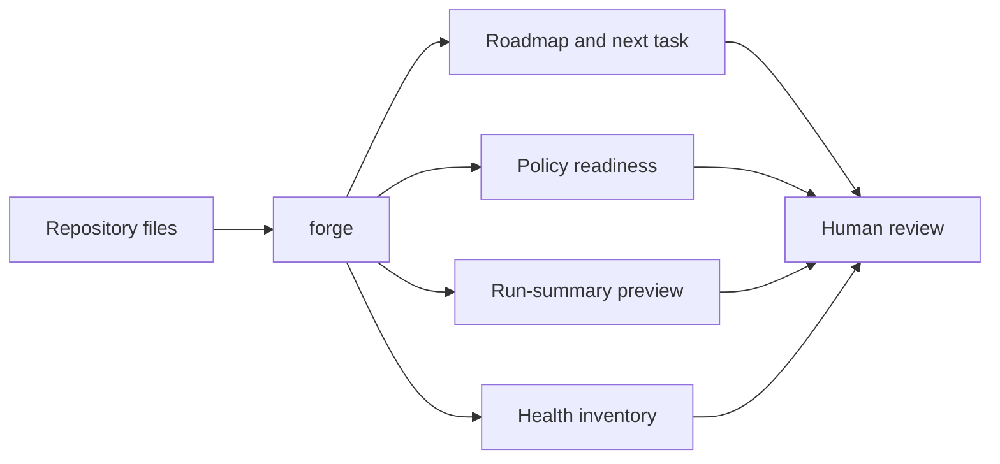

# Autonomous Forge overview

Autonomous Forge is a local-first CLI for inspecting a repository's maintenance plan before automation is allowed to act.



## Current boundary

Every implemented command is read-only. The CLI does not call an AI model, edit source files, run shell commands, create commits, push changes, scan secrets, or access the network.

## First commands to try

```text
forge report
forge tasks --next
forge policy
forge inventory --root .
```

The tool is pre-alpha. It is an inspection layer for safer future AI-assisted maintenance, not an autonomous coding agent.
